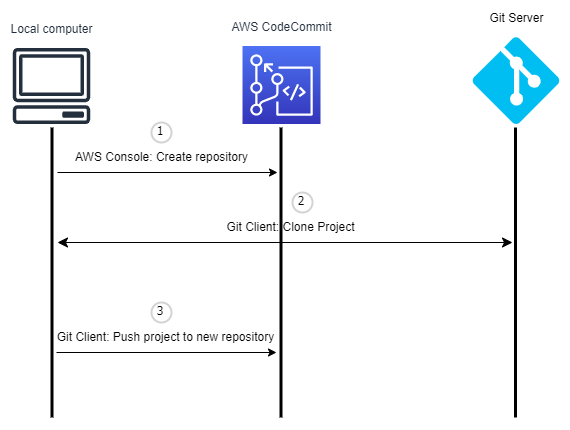
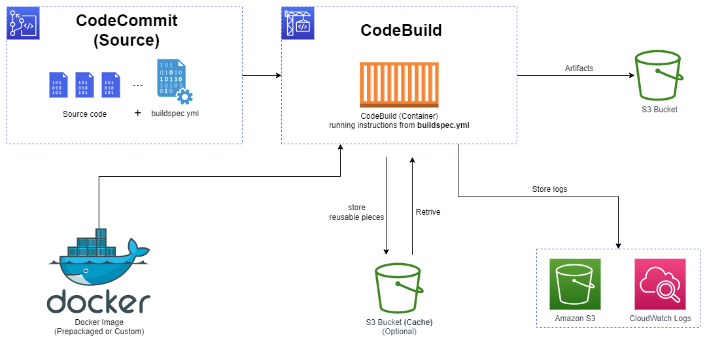

# AWS CI/CD - CodeCommit, CodePipeline, CodeBuild, CodeDeploy, CodeStar, CodeArtifact, CodeGuru, Cloud9<!-- omit in toc -->

## Contents <!-- omit in toc -->

- [1. CICD in AWS](#1-cicd-in-aws)
- [2. Continuous Integration (CI)](#2-continuous-integration-ci)
- [3. Continuous Delivery (CD)](#3-continuous-delivery-cd)
- [4. AWS CodeCommit](#4-aws-codecommit)
  - [4.1. Security](#41-security)
  - [4.2. Migrations](#42-migrations)
  - [4.3. CodeCommit vs. GitHub](#43-codecommit-vs-github)
  - [4.4. Monitoring with EventBridge](#44-monitoring-with-eventbridge)
  - [4.5. Migrate a project](#45-migrate-a-project)
  - [4.6. Cross-Region Replication](#46-cross-region-replication)
  - [4.7. Branch Security](#47-branch-security)
  - [4.8. Pull Request Approval Rules](#48-pull-request-approval-rules)
- [5. AWS CodePipeline](#5-aws-codepipeline)
  - [5.1. How pipeline executions are started](#51-how-pipeline-executions-are-started)
  - [5.2. Artifacts](#52-artifacts)
  - [5.3. Troubleshooting](#53-troubleshooting)
  - [5.4. Events vs.Webhooks vs. Polling](#54-events-vswebhooks-vs-polling)
  - [5.5. Action types constraints for artifacts](#55-action-types-constraints-for-artifacts)
  - [5.6. Manual Approval Stage](#56-manual-approval-stage)
  - [5.7. CloudFormation as a target](#57-cloudformation-as-a-target)
  - [5.8. CloudFormation integration](#58-cloudformation-integration)
  - [5.9. Best Practices](#59-best-practices)
  - [5.10. EventBridge](#510-eventbridge)
  - [5.11. Invoke Action](#511-invoke-action)
  - [5.12. Multi Region](#512-multi-region)
  - [5.13. Pipeline executions](#513-pipeline-executions)
- [6. AWS CodeBuild](#6-aws-codebuild)
  - [6.1. Details](#61-details)
  - [6.2. Supported Environments](#62-supported-environments)
  - [6.3. How it Works](#63-how-it-works)
  - [6.4. buildspec.yml](#64-buildspecyml)
    - [6.4.1. Custom buildspec file name and location](#641-custom-buildspec-file-name-and-location)
  - [6.5. Local Build](#65-local-build)
  - [6.6. Inside VPC](#66-inside-vpc)
  - [6.7. Environment Variables](#67-environment-variables)
  - [6.8. CloudFormation Integration](#68-cloudformation-integration)
  - [6.9. Timeouts](#69-timeouts)
  - [6.10. Build Badges](#610-build-badges)
  - [6.11. Triggers](#611-triggers)
  - [6.12. Validate Pull Requests](#612-validate-pull-requests)
  - [6.13. Test Reports](#613-test-reports)
  - [6.14. Security](#614-security)
    - [6.14.1. CodeBuild Service Role](#6141-codebuild-service-role)
- [7. AWS CodeDeploy](#7-aws-codedeploy)
- [8. AWS CodeStar](#8-aws-codestar)
- [9. AWS CodeArtifact](#9-aws-codeartifact)
  - [9.1. Resource Policy](#91-resource-policy)
  - [9.2. Upstream Repositories](#92-upstream-repositories)
  - [9.3. External Connection](#93-external-connection)
  - [9.4. Retention](#94-retention)
  - [9.5. Domains](#95-domains)
- [10. Amazon CodeGuru](#10-amazon-codeguru)
  - [10.1. Reviewer](#101-reviewer)
  - [10.2. Profiler](#102-profiler)
    - [10.2.1. Reviewer Secrets Detector](#1021-reviewer-secrets-detector)
    - [10.2.2. Ftunction decoractors](#1022-ftunction-decoractors)
  - [10.3. Agent Configuration](#103-agent-configuration)
- [11. AWS Cloud9](#11-aws-cloud9)
- [12. Sections erros](#12-sections-erros)

# 1. CICD in AWS

- This is all about automating the deployment we've done so far while adding increased safety:
  - **AWS CodeCommit:** Storing our code.
  - **AWS CodePipeline:** Automating our pipeline from code to Elastic Beanstalk.
  - **AWS CodeBuild:** Building and testing our code.
  - **AWS CodeDeploy:** Deploying the code to EC2 instances (not Elastic Beanstalk).
  - **AWS CodeStar:** Manage software development activities in one place.
  - **AWS CodeArtifact:** Store, publish, and share software packages.
  - **AWS CodeGuru:** Automated code reviews using Machine Learning.

# 2. Continuous Integration (CI)

- Developers push the code to a code repository often (e.g., GitHub, CodeCommit, Bitbucket...).
- A testing / build server checks the code as soon as it's pushed (CodeBuild, Jenkins CI, ...).
- The developer gets feedback about the tests and checks that have passed / failed.
- Find bugs early, then fix bugs.
- Deliver faster as the code is tested.
- Deploy often.
- Happier developers, as they're unblocked.

# 3. Continuous Delivery (CD)

- Ensures that the software can be released reliably whenever needed.
- Ensures deployments happen often and are quick.
- Shift away from "one release every 3 months" to "5 releases a day".
- That usually means automated deployment (e.g., CodeDeploy, Jenkins CD, Spinnaker, ...).

# 4. AWS CodeCommit

- **Version control** is the ability to understand the various changes that happened to the code over time (and possibly roll back).
- All these are enabled by using a version control system such as **Git**.
- A Git repository can be synchronized on your computer, but it usually is uploaded on a central online repository.
- Benefits are:
  - Collaborate with other developers.
  - Make sure the code is backed-up somewhere.
  - Make sure it's fully viewable and auditable.
- Git repositories can be expensive.
- The industry includes GitHub, GitLab, Bitbucket, ...
- And **AWS CodeCommit**:
  - Private Git repositories.
  - No size limit on repositories (scale seamlessly).
  - Fully managed, highly available.
  - Code only in AWS Cloud account => increased security and compliance.
  - Security (encrypted, access control, ...).
  - Integrated with Jenkins, AWS CodeBuild, and other CI tools.

## 4.1. Security

- Interactions are done using Git (standard).
- **Authentication**
  - **SSH Keys:** AWS Users can configure SSH keys in their IAM Console.
  - **HTTPS:**
    1. Set-up a **Git credential helper** using your access key credentials specified in your AWS credential profile.
    2. Generate HTTPS Git credentials for AWS CodeCommit (IAM).
       1. Specify the credentials in the Git Credential Manager.
- **Authorization**
  - IAM policies to manage users/roles permissions to repositories.
- **Encryption**
  - Repositories are automatically encrypted at rest using AWS KMS.
  - Encrypted in transit (can only use HTTPS or SSH - both secure).
- **Cross-account Access**
  - Do NOT share your SSH keys or your AWS credentials.
  - Use an IAM Role in your AWS account and use AWS STS (`AssumeRole` API).

## 4.2. Migrations

- You can migrate to CodeCommit from other version control systems, such:
  - Perforce.
  - Subversion.
  - TFS.
- **But you must first migrate to Git.**

## 4.3. CodeCommit vs. GitHub

|                                     | CodeCommit              | GitHub                                                            |
| ----------------------------------- | ----------------------- | ----------------------------------------------------------------- |
| Support Code Review (Pull Requests) | Ok                      | Ok                                                                |
| Integration with AWS CodeBuild      | Ok                      | Ok                                                                |
| Authentication (SSH & HTTPS)        | Ok                      | Ok                                                                |
| Security                            | IAM Users & Roles       | GitHub Users                                                      |
| Hosting                             | Managed & hosted by AWS | Hosted by GitHub / GitHub Enterprise: self hosted on your servers |
| UI                                  | Minimal                 | Fully Featured                                                    |

## 4.4. Monitoring with EventBridge

- You can monitor CodeCommit events in EventBridge (near real-time).
- `pullRequestCreated`, `pullRequestStatusChanged`, `referenceCreated`, `commentOnCommitCreated`.

## 4.5. Migrate a project

- To migrate a project hosted on another Git repository to CodeCommit, you have to follow the process, below:
  1. Complete the initial setup required for CodeCommit.
  2. Create a CodeCommit repository.
  3. Clone the repository and push it to CodeCommit.
  4. View files in the CodeCommit repository.
  5. Share the CodeCommit repository with your team.

## 4.6. Cross-Region Replication

- Use case: achieve lower latency pulls for global developers, backups...
  - us-east-1 > us-east-2

## 4.7. Branch Security

- By default, a user who has push permissions to a CodeCommit repository can contribute to any branch.
- Use IAM policies to restrict users to push or merge code to a specific branch.
- Example: only senior developers can push to production branch.
- **Note: Resource Policy is not supported yet.**

## 4.8. Pull Request Approval Rules

- Helps ensure the quality of your code by requiring user(s) to approve the open PRs before the code can be merged.
- Specify a pool of users to approve and number of users who must approve the PR.
- Specify IAM Principal ARN (IAM users, federated users, IAM Roles, IAM Groups).
- Approval Rule Templates.
- Automatically apply Approval Rules to PRs in specific repositories.
- Example: define different rules for dev and prod branches.

# 5. AWS CodePipeline

- Visual Workflow to orchestrate your CI/CD.
- **Source:** CodeCommit, ECR, S3, Bitbucket, GitHub.
- **Build:** CodeBuild, Jenkins, CloudBees, TeamCity.
- **Test:** CodeBuild, AWS Device Farm, 3rd party tools, ...
- **Deploy:** CodeDeploy, Elastic Beanstalk, CloudFormation, ECS, S3, ...
- **Invoke:** Lambda, Step Functions.
- Consists of stages:
  - Each stage can have sequential actions and/or parallel actions.
  - Example: Build -> Test -> Deploy -> Load Testing -> ...
  - Manual approval can be defined at any stage.

## 5.1. How pipeline executions are started

- You can trigger an execution when you **change your source code** or **manually** start the pipeline.
- You can also trigger an execution through an [Amazon CloudWatch](AWS%20CloudWatch.md) Events rule that you schedule.

## 5.2. Artifacts

- Each pipeline stage can create `artifacts`.
- `artifacts` - This element represents information about where CodeBuild can find the build output and how CodeBuild prepares it for uploading to the S3 output bucket.
  - Artifacts stored in an S3 bucket and passed on to the next stage.

## 5.3. Troubleshooting

- For CodePipeline Pipeline/Action/Stage Execution State Changes.
- Use **CloudWatch Events (Amazon EventBridge)**.
- Example:
  - You can create events for failed pipelines.
  - You can create events for cancelled stages.
- If CodePipeline fails a stage, your pipeline stops, and you can get information in the console.
- If pipeline can't perform an action, make sure the "IAM Service Role" attached does have enough IAM permissions (IAM Policy).
- AWS CloudTrail can be used to audit AWS API calls.

## 5.4. Events vs.Webhooks vs. Polling

- Events
  - CodeCommit -> `event` -> EventBridge -> `trigger` -> CodePipeline
  - GitHub -> CodeStar Source Connection (GitHub App) -> `trigger` -> CodePipeline
  - **Note: Events are the default and recommended**
- Webhooks
  - Script/Code -> `HTTP Webhook` CodePipeline
- Polling
  - GitHub -> regular checks -> CodePipeline

## 5.5. Action types constraints for artifacts

- **Owner**
  - **AWS:** For AWS services.
  - **3rd Party:** GitHub or Alexa Skills Kit.
  - **Custom:** Jenkins.
- **Action Type**
  - **Source:** S3, ECR, GitHub, ...
  - **Build:** CodeBuild, Jenkins.
  - **Test:** CodeBuild, Device Farm, Jenkins.
  - **Approval:** Manual.
  - **Invoke:** Lambda.
  - **Deploy:** S3, CloudFormation, CodeDeploy, Elastic Beanstalk, OpsWorks, ECS, Service Catalog, ...

## 5.6. Manual Approval Stage

- CodePipeline
  - CodeCommit -> `new commit` CodeBuild -> `trigger` > Manual Approval -> `deploy` -> CodeDeploy
- **Important: Owner is "AWS", Action is "Manual".**

## 5.7. CloudFormation as a target

- CloudFormation Deploy Action can be used to deploy AWS resources.
- Example: deploy Lambda functions using CDK or SAM (alternative to CodeDeploy).
- Works with CloudFormation StackSets to deploy across multiple AWS accounts and AWS Regions.
- Configure different settings:
  - Stack name, Change Set name, template, parameters, IAM Role, Action Mode...
- **Action Modes**
  - Create or Replace a Change Set, Execute a Change Set.
  - Create or Update a Stack, Delete a Stack, Replace a Failed Stack.
- **Template Parameter Overrides**
  - Specify a JSON object to override parameter values.
  - Retrives the parameter value from CodePipeline Input Artifact.
  - All parameter names must be present in the template.
  - **Static:** Use template configuration file (recommended).
  - **Dynamic:** Use parameter overrides.

## 5.8. CloudFormation integration

- `CREATE_UPDATE` - Create or update an existing stack.
- `DELETE_ONLY` - Delete a stack if it exists.

## 5.9. Best Practices

- One CodePipeline, One CodeDeploy, Parallel deploy to multiple Deployment Groups.
- Parallel Actions using in a Stage using RunOrder.
- Deploy to Pre-Prod before Deploying to Prod.

## 5.10. EventBridge

- EventBridge - Detect and react to changes in execution states (e.g., intercept failures at certain stages).

## 5.11. Invoke Action

- **Lambda:** Invokes a Lambda function within a Pipeline.
- **Step Functions:** Starts a State Machine within a Pipeline.

## 5.12. Multi Region

- Actions in your pipeline can be in different regions.
  - Example: deploy a Lambda function through CloudFormation into multiple regions.
- S3 Artifact Stores must be defined in each region where you have actions.
  - CodePipeline must have read/write access into every artifact buckets.
  - If you use the console default artifact buckets are configured, else you must create them.
- CodePipeline handles the copying of input artifacts from one AWS Region to the other Regions when performing cross-region actions.
  - In your cross-region actions, only reference the name of the input artifacts.

## 5.13. Pipeline executions

- Traverse pipeline stages in order.
- Valid statuses for pipelines are:
  - InProgress
  - Stopping
  - Stopped
  - Succeeded
  - Superseded
  - Failed.

# 6. AWS CodeBuild

- A fully managed continuous integration (CI) service.
- Continuous scaling (no servers to manage or provision - no build queue).
- Compile source code, run tests, produce software packages, ...
- Alternative to other build tools (e.g., Jenkins).
- Charged per minute for compute resources (time it takes to complete the builds).
- Leverages Docker under the hood for reproducible builds.
- Use prepackaged Docker images or create your own custom Docker image.

## 6.1. Details

- **Source:** CodeCommit, S3, Bitbucket, GitHub.
- **Build instructions:** Code file buildspec.yml or insert manually in Console.
- **Output logs** can be stored in Amazon S3 & CloudWatch Logs.
- Use CloudWatch Metrics to monitor build statistics.
- Use EventBridge (CloudWatch Events) to detect failed builds and trigger notifications.
- Use CloudWatch Alarms to notify if you need "thresholds" for failures.
- **Build Projects can be defined within CodePipeline or CodeBuild.**

## 6.2. Supported Environments

- Java.
- Ruby.
- Python.
- Go.
- Node.js.
- Android.
- .NET Core.
- PHP.
- Docker - extend any environment you like.

## 6.3. How it Works

## 6.4. buildspec.yml

- `buildspec.yml` file must be at the **root** of your code.
- `env` - define environment variables
  - `variables` - plaintext variables.
  - `parameter-store` - variables stored in SSM Parameter Store.
  - `secrets-manager` - variables stored in AWS Secrets Manager.
- `phases` - specify commands to run:
  - `install` - install dependencies you may need for your build.
  - `pre_build` - final commands to execute before build.
  - `build` - actual build commands.
  - `post_build` - finishing touches (e.g., zip output).
- `artifacts` - what to upload to S3 (encrypted with KMS).
- `cache` - files to cache (usually dependencies) to S3 for future build speedup.
- Order:
  - SUBMITTED
  - PROVISIONING
  - DOWNLOAD_SOURCE
    - INSTALL
    - PRE_BUILD
    - BUILD
    - POST_BUILD
  - UPLOAD_ARTIFACTS
  - FINALIZING

### 6.4.1. Custom buildspec file name and location

- To override the default buildspec file name, location, or both, do one of the following:

1. Run the AWS CLI `create-project` or `update-project` command, setting the buildspec value to the path to the alternate buildspec file relative to the value of the built-in environment variable `CODEBUILD_SRC_DIR`.
2. Run the AWS CLI `start-build` command, setting the `buildspecOverride` value to the path to the alternate buildspec file relative to the value of the built-in environment variable `CODEBUILD_SRC_DIR`.
3. In an AWS CloudFormation template, set the BuildSpec property of Source in a resource of type `AWS::CodeBuild::Project` to the path to the alternate buildspec file relative to the value of the built-in environment variable `CODEBUILD_SRC_DIR`.

## 6.5. Local Build

- In case of need of deep troubleshooting beyond logs...
- You can run CodeBuild locally on your desktop (after installing Docker).
- For this, leverage the CodeBuild Agent.
- [Run builds locally with the AWS CodeBuild agent](https://docs.aws.amazon.com/codebuild/latest/userguide/use-codebuild-agent.html)

## 6.6. Inside VPC

- By default, your CodeBuild containers are launched outside your VPC.
  - It cannot access resources in a VPC.
- You can specify a VPC configuration:
  - VPC ID.
  - Subnet IDs.
  - Security Group IDs.
- Then your build can access resources in your VPC (e.g., RDS, ElastiCache, EC2, ALB, ...).
- Use cases: integration tests, data query, internal load balancers, ...

## 6.7. Environment Variables

- **Default Environment Variables**
  - Defined and provided by AWS.
  - AWS_DEFAULT_REGION, CODEBUILD_BUILD_ARN, CODEBUILD_BUILD_ID, CODEBUILD_BUILD_IMAGE...
- **Custom Environment Variables**
  - **Static:** Defined at build time (override using start-build API call).
  - **Dynamic:** Using SSM Parameter Store and Secrets Manager.

## 6.8. CloudFormation Integration

- CloudFormation is used to deploy complex infrastructure using an API:
  - `CREATE_UPDATE` - create or update an existing stack.
  - `DELETE_ONLY` - delete a stack if it exists.

## 6.9. Timeouts

- A build represents a set of actions performed by AWS CodeBuild to create output artifacts (for example, a JAR file) based on a set of input artifacts (for example, a collection of Java class files).
- A build in a queue that does not start after the number of minutes specified in its time out value is removed from the queue.
  - **The default timeout value is eight hours.**
  - You can override the build queue timeout with a value **between five minutes and eight hours** when you run your build.
- By setting the timeout configuration, the build process will automatically terminate post the expiry of the configured timeout.

## 6.10. Build Badges

- Dynamically generated badge that displays the status of the latest build.
- Can be accessed through a public URL for your CodeBuild project.
- Supported for **CodeCommit, GitHub, and BitBucket**.
- **Note: Badges are available at the branch level.**

## 6.11. Triggers

- CodeCommit -> `event` -> EventBridge -> `trigger` -> CodeBuild.
- CodeCommit -> `event` -> EventBridge -> `trigger` -> Lambda -> `trigger` -> CodeBuild.
- GitHub -> `trigger` -> Web Hook -> `trigger` -> CodeBuild.

## 6.12. Validate Pull Requests

- Validate proposed code changes in PRs before they get merged.
- Ensure high level of code quality and avoid code conflicts.

## 6.13. Test Reports

- Contains details about tests that are run during builds.
- **Unit tests, configuration tests, functional tests**.
- Create your test cases with any test framework that can create report files in the following format:
  - JUnit XML, NUnit XML, NUnit3 XML.
  - Cucumber JSON, TestNG XML, Visual Studio TRX.
- Create a test report and add a **Report Group** name in **buildspec.yml** file with information about your tests.

## 6.14. Security

- Integration with KMS for encryption of build artifacts.
- IAM for CodeBuild permissions, and VPC for network security.
- AWS CloudTrail for API calls logging.

### 6.14.1. CodeBuild Service Role

- Allows CodeBuild to access AWS resources on your behalf (assign the required permissions).
- Use cases:
  - Download code from CodeCommit repository.
  - Fetch parameters from SSM Parameter Store.
  - Upload build artifacts to S3 bucket.
  - Fetch secrets from Secrets Manager.
  - Store logs in CloudWatch Logs.
- In-transit and at-rest data encryption (cache, logs...).
- Build output artifact encryption (requires access to KMS).

# 7. AWS CodeDeploy

[AWS CodeDeploy](AWS%20CodeDeploy.md)

# 8. AWS CodeStar

- An integrated solution that groups: GitHub, CodeCommit, CodeBuild, CodeDeploy, CloudFormation, CodePipeline, CloudWatch, ...
- Quickly create "CICD-ready" projects for EC2, Lambda, Elastic Beanstalk.
- Supported languages: C#, Go, HTML 5, Java, Node.js, PHP, Python, Ruby.
- Issue tracking integration with JIRA / GitHub Issues.
- Ability to integrate with Cloud9 to obtain a web IDE (not all regions).
- One dashboard to view all your components.
- Free service, pay only for the underlying usage of other services.
- Limited Customization.

# 9. AWS CodeArtifact

- Software packages depend on each other to be built (also called code dependencies), and new ones are created.
- Storing and retrieving these dependencies is called **artifact management**.
- Traditionally you need to setup your own artifact management system.
- **CodeArtifact** is a secure, scalable, and cost-effective **artifact management** for software development.
- Works with common dependency management tools such as Maven, Gradle, npm, yarn, twine, pip, and NuGet.
- **Developers and CodeBuild can then retrieve dependencies straight from CodeArtifact.**

## 9.1. Resource Policy

- Can be used to authorize another account to access CodeArtifact.
- A given principal can either read all the packages in a repository or none of them.

## 9.2. Upstream Repositories

- A CodeArtifact repository can have other CodeArtifact repositories as **Upstream Repositories**.
- Allows a package manager client to access the packages that are contained in more than one repository using a single repository endpoint.
- Up to 10 Upstream Repositories.
- Only one external connection.

## 9.3. External Connection

- An External Connection is a connection between a CodeArtifact Repository and an external/public repository (e.g., Maven, npm, PyPI, NuGet...).
- Allows you to fetch packages that are not already present in your CodeArtifact Repository.
- A repository has a maximum of 1 external connection.
- Create many repositories for many external connections.
- Example - Connect to npmjs.com:
  - Configure one CodeArtifact Repository in your domain with an external connection to npmjs.com.
  - Configure all the other repositories with an upstream to it.
  - Packages fetched from npmjs.com are cached in the Upstream Repository, rather than fetching and storing them in each Repository.

## 9.4. Retention

- If a requested package version is found in an Upstream Repository, a reference to it is retained and is always available from the Downstream Repository
- The retained package version is not affected by changes to the Upstream Repository (deleting it, updating the package, ...)
- Intermediate repositories do not keep the package
- Example - Fetching Package from npmjs.com
  - Package Manager connected to Repository A requests the package **Lodash v4.17.20**
  - The package version is not present in any of the three repositories
  - The package version will be fetched from npmjs.com
  - When **Lodash 4.17.20** is fetched, it will be retained in:
    - **Repository A** - the most-downstream repository
    - **Repository C** - has the external connection to npmjs.com
    - The Package version will not be retained in Repository B as that is an intermediate Repository

## 9.5. Domains

- **Deduplicated Storage:** Asset only needs to be stored once in a domain, even if it's available in many repositories (only pay once for storage).
- **Fast Copying:** Only metadata record are updated when you pull packages from an Upstream CodeArtifact Repository into a Downstream.
- **Easy Sharing Across Repositories and Teams:** All the assets and metadata in a domain are encrypted with a single AWS KMS Key.
- **Apply Policy Across Multiple Repositories:** Domain administrator can apply policy across the domain such as:
  - Restricting which accounts have access to repositories in the domain.
  - Who can configure connections to public repositories to use as sources of packages.

# 10. Amazon CodeGuru

- **Amazon CodeGuru is a developer tool that provides intelligent recommendations to improve code quality and identify an application's most expensive lines of code.**
- An ML-powered service for **automated code reviews** and **application performance recommendations**.
- Provides two functionalities
  - **CodeGuru Reviewer:** Automated code reviews for static code analysis (development).
  - **CodeGuru Profiler:** Visibility/recommendations about application performance during runtime (production).

## 10.1. Reviewer

- Identify critical issues, security vulnerabilities, and hard-to-find bugs.
- Example: common coding best practices, resource leaks, security detection, input validation.
- Uses Machine Learning and automated reasoning.
- Hard-learned lessons across millions of code reviews on 1000s of open-source and Amazon repositories.
- Supports Java and Python.
- Integrates with GitHub, Bitbucket, and AWS CodeCommit.

## 10.2. Profiler

- Helps understand the runtime behavior of your application.
- Example: identify if your application is consuming excessive CPU capacity on a logging routine.
- Features:
  - Identify and remove code inefficiencies.
  - Improve application performance (e.g., reduce CPU utilization).
  - Decrease compute costs.
  - Provides heap summary (identify which objects using up memory).
  - Anomaly Detection.
- Support applications running on AWS or on-premise.
- Minimal overhead on application.

### 10.2.1. Reviewer Secrets Detector

- Uses ML to identify hardcoded secrets embedded in your code (e.g., passwords, API keys, credentials, SSH keys...).
- Besides scanning code, it scans configuration and documentation files.
- Suggests remediation to automatically protect your secrets with Secrets Manager.

### 10.2.2. Ftunction decoractors

- Integrate and apply CodeGuru Profiler to Lambda functions either using:
  - Function Decorator `@with_lambda_profiler`
  - Add codeguru_profiler_agent dependency to your **Lambda function .zip** file or use **Lambda Layers**.
- Enable Profiling in the Lambda function configuration.

## 10.3. Agent Configuration

- `MaxStackDepth` - the maximum depth of the stacks in the code that is represented in the profile.
  - Example: if CodeGuru Profiler finds a method A, which calls method B, which calls method C, which calls method D, then the depth is 4.
  - If the MaxStackDepth is set to 2, then the profiler evaluates A and B.
- `MemoryUsageLimitPercent` - The memory percentage used by the profiler.
- `MinimumTimeForReportingInMilliseconds` - The minimum time between sending reports (milliseconds).
- `ReportingIntervalInMilliseconds` - The reporting interval used to report profiles (milliseconds).
- `SamplingIntervalInMilliseconds` - The sampling interval that is used to profile samples (milliseconds).
  - Reduce to have a higher sampling rate.

# 11. AWS Cloud9

- Cloud-based Integrated Development Environment (IDE).
- Code editor, debugger, terminal in a browser.
- Work on your projects from anywhere with an Internet connection.
- Prepackaged with essential tools for popular programming languages (JavaScript, Python, PHP, ...).
- Share your development environment with your team (pair programming).
- Fully integrated with AWS SAM & Lambda to easily build serverless applications.

# 12. Sections erros

- `DownloadBundle` deployment lifecycle event will throw an error whenever:
  - The EC2 instance's IAM profile does not have permission to access the application code in the Amazon S3.
  - An Amazon S3 internal error occurs.
  - The instances you deploy to are associated with one AWS Region (for example, US West Oregon), but the Amazon S3 bucket that contains the application revision is related to another AWS Region (for example, US East N. Virginia).
