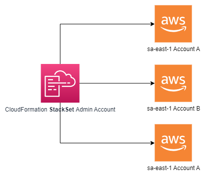

# AWS CloudFormation<!-- omit in toc -->

## Contents <!-- omit in toc -->

- [1. Introduction Infrastructure as Code](#1-introduction-infrastructure-as-code)
  - [1.1. What is CloudFormation](#11-what-is-cloudformation)
  - [1.2. Benefits of AWS CloudFormation](#12-benefits-of-aws-cloudformation)
  - [1.3. How CloudFormation Works](#13-how-cloudformation-works)
  - [1.4. Deploying CloudFormation templates](#14-deploying-cloudformation-templates)
  - [1.5. CloudFormation Building Blocks](#15-cloudformation-building-blocks)
- [2. YAML](#2-yaml)
  - [2.1. Resources](#21-resources)
    - [2.1.1. How do I find resources documentation?](#211-how-do-i-find-resources-documentation)
    - [2.1.2. FAQ for resources](#212-faq-for-resources)
  - [2.2. Parameters](#22-parameters)
    - [2.2.1. When should you use a parameter?](#221-when-should-you-use-a-parameter)
    - [2.2.2. Parameters Settings](#222-parameters-settings)
    - [2.2.3. How to Reference a Parameter](#223-how-to-reference-a-parameter)
    - [2.2.4. Concept: Pseudo Parameters](#224-concept-pseudo-parameters)
    - [2.2.5. Systems Manager parameter](#225-systems-manager-parameter)
  - [2.3. Mappings](#23-mappings)
    - [2.3.1. When would you use Mappings vs Parameters?](#231-when-would-you-use-mappings-vs-parameters)
    - [2.3.2. Fn::FindInMap Accessing Mapping Values](#232-fnfindinmap-accessing-mapping-values)
  - [2.4. Outputs](#24-outputs)
    - [2.4.1. Example](#241-example)
    - [2.4.2. Cross Stack Reference](#242-cross-stack-reference)
  - [2.5. Conditions](#25-conditions)
    - [2.5.1. How to define a condition?](#251-how-to-define-a-condition)
    - [2.5.2. Using a Condition](#252-using-a-condition)
- [3. Must Know Intrinsic Functions](#3-must-know-intrinsic-functions)
  - [3.1. Fn::Ref](#31-fnref)
  - [3.2. Fn::GetAtt](#32-fngetatt)
  - [3.3. Fn::FindInMap - Accessing Mapping Values](#33-fnfindinmap---accessing-mapping-values)
  - [3.4. Fn::ImportValue](#34-fnimportvalue)
  - [3.5. Fn::Join](#35-fnjoin)
  - [3.6. Fn::Sub](#36-fnsub)
  - [3.7. Condition Functions](#37-condition-functions)
  - [3.8. Fn::GetAZs](#38-fngetazs)
  - [3.9. Fn::Select](#39-fnselect)
- [4. Rollbacks](#4-rollbacks)
- [5. Stack Notifications](#5-stack-notifications)
- [6. ChangeSets](#6-changesets)
- [7. Nested stacks](#7-nested-stacks)
- [8. CloudFormation - Cross vs Nested Stacks](#8-cloudformation---cross-vs-nested-stacks)
- [9. StackSets](#9-stacksets)
- [10. Drift](#10-drift)
- [11. Stack Policies](#11-stack-policies)
- [12. CloudFormation helper scripts reference](#12-cloudformation-helper-scripts-reference)

# 1. Introduction Infrastructure as Code

- Currently, we have been doing a lot of manual work.
- All this manual work will be very tough to reproduce:
  - In another region.
  - in another AWS account.
  - Within the same region if everything was deleted.
- Wouldn't it be great, if all our infrastructure was... code?
- That code would be deployed and create / update / delete our infrastructure

## 1.1. What is CloudFormation

- CloudFormation is a declarative way of outlining your AWS Infrastructure, for any resources (most of them are supported).
- For example, within a CloudFormation template, you say:
  - I want a security group.
  - I want two EC2 machines using this security group.
  - I want two Elastic IPs for these EC2 machines.
  - I want an S3 bucket.
  - I want a load balancer (ELB) in front of these machines.
- Then CloudFormation creates those for you, in the right order, with the exact configuration that you specify.

## 1.2. Benefits of AWS CloudFormation

- **Infrastructure as code**
  - No resources are manually created, which is excellent for control.
  - The code can be version controlled for example using git.
  - Changes to the infrastructure are reviewed through code.
- **Cost**
  - Each resources within the stack is tagged with an identifier so you can easily see how much a stack costs you.
  - You can estimate the costs of your resources using the CloudFormation template.
  - Savings strategy: In Dev, you could automation deletion of templates at 5 PM and recreated at 8 AM, safely.
- **Productivity**
  - Ability to destroy and re-create an infrastructure on the cloud on the fly.
  - Automated generation of Diagram for your templates!
  - Declarative programming (no need to figure out ordering and orchestration).
- Separation of concern: create many stacks for many apps, and many layers. Ex:
  - VPC stacks.
  - Network stacks.
  - App stacks.
- **Don't re-invent the wheel**
  - Leverage existing templates on the web!
  - Leverage the documentation.

## 1.3. How CloudFormation Works

- Templates have to be uploaded in S3 and then referenced in
  CloudFormation
- To update a template, we can't edit previous ones. We have to re-upload a new version of the template to AWS
- Stacks are identified by a name
- Deleting a stack deletes every single artifact that was created by CloudFormation.

## 1.4. Deploying CloudFormation templates

- Manual way:
  - Editing templates in the CloudFormation Designer
  - Using the console to input parameters, etc
- Automated way:
  - Editing templates in a YAML file
  - Using the AWS CLI (Command Line Interface) to deploy the templates
  - Recommended way when you fully want to automate your flow

## 1.5. CloudFormation Building Blocks

- Templates components (one course section for each):

1. Resources: your AWS resources declared in the template (MANDATORY).
2. Parameters: the dynamic inputs for your template.
3. Mappings: the static variables for your template.
4. Outputs: References to what has been created.
5. Conditionals: List of conditions to perform resource creation.
6. Metadata.

- Templates helpers:

1. References.
2. Functions.

# 2. YAML

- YAML and JSON are the languages you can use for CloudFormation.
  - JSON
  - YAML (better)

## 2.1. Resources

- Resources are the core of your CloudFormation template (MANDATORY).
- They represent the different AWS Components that will be created and configured.
- Resources are declared and can reference each other.
- AWS figures out creation, updates and deletes of resources for us.
- There are over ~224 types of resources.
- Resource types identifiers are of the form:
  - `Type: AWS::aws-product-name::data-type-name`
  - Example:
    ```
      Resources:
        MyInstance:
          Type: AWS::EC2::Instance
          Properties:
            AvailabilityZone: sa-east-1a
            ImageId: ami-3sd89f07
            InstanceType: t2.micro
    ```

### 2.1.1. How do I find resources documentation?

- All the resources can be found here: [Resources](https://docs.aws.amazon.com/AWSCloudFormation/latest/UserGuide/aws-template-resource-type-ref.html)
- Example here (for an EC2 instance): [Example](https://docs.aws.amazon.com/AWSCloudFormation/latest/UserGuide/aws-properties-ec2-instance.html)

### 2.1.2. FAQ for resources

- Can I create a dynamic amount of resources?
  - No, you can't.
    - Everything in the CloudFormation template has to be declared.
  - You can't perform code generation there.
- Is every AWS Service supported?
  - Almost. Only a select few niches are not there yet.
  - You can work around that using AWS Lambda Custom Resources.

## 2.2. Parameters

- Parameters are a way to provide inputs to your AWS CloudFormation template.
- They're important to know about if:
  - You want to reuse your templates across the company.
  - Some inputs can not be determined ahead of time.
- Parameters are extremely powerful, controlled, and can prevent errors from happening in your templates thanks to types.

### 2.2.1. When should you use a parameter?

- Ask yourself this:
  - Is this CloudFormation resource configuration likely to change in the future?
  - If so, make it a parameter.
- You won't have to re-upload a template to change its content.
- Example:
  ```
    Parameters:
      SecurityGroupDescription:
        Description: Security Group Description
        Type: String
  ```

### 2.2.2. Parameters Settings

- Parameters can be controlled by all these settings:
  - Type:
    - String
    - Number
    - CommaDelimitedList
    - List<Type>
    - AWS Parameter (to help catch invalid values - match against existing values in the AWS Account)
  - Description
  - Constraints
  - ConstraintDescription (String)
  - Min/MaxLength
  - Min/MaxValue
  - Defaults
  - AllowedValues (array)
  - AllowedPattern (regexp)
  - NoEcho (Boolean)

### 2.2.3. How to Reference a Parameter

- The `Fn::Ref` function can be leveraged to reference parameters.
- Parameters can be used anywhere in a template.
- The shorthand for this in YAML is `!Ref`
- The function can also reference other elements within the template.
- Example:
  ```
    Parameters:
      SecurityGroupDescription:
        Description: Security Group Description
        Type: String
  ```
  ```
    ServerSecurityGroup:
      Type: AWS::EC2::SecurityGroup
      Properties:
        GroupDescription: !Ref SecurityGroupDescription
  ```

### 2.2.4. Concept: Pseudo Parameters

- AWS offers us pseudo parameters in any CloudFormation template.
- These can be used at any time and are enabled by default

| Reference Value       | Example Return Value                                               |
| --------------------- | ------------------------------------------------------------------ |
| AWS::AccountId        | 1234567890                                                         |
| AWS::NotificationARNs | [arn:aws:sns:us-east-1:123456789012:MyTopic]                       |
| AWS::NoValue          | Does not return a value                                            |
| AWS::Region           | us-east-2                                                          |
| AWS::StackId          | rn:aws:cloudformation:us-east-1:123456789012:stack/MyStack/1c2fa62 |
| AWS::StackName        | MyStack                                                            |

### 2.2.5. Systems Manager parameter

- CloudFormation parameters already support certain AWS specific types.
- SSM parameter types will be an addition to these types.
- New parameter types introduced in CloudFormation are:

- `AWS::SSM::Parameter::Name`
- `AWS::SSM::Parameter::Value<String>`
- `AWS::SSM::Parameter::Value<List<String>>`
- `AWS::SSM::Parameter::Value<Any AWS type>`

- Example:
  ```
    aws ssm put-parameter --name myEC2TypeDev --type String --value "t2.small"

    Parameters:
      InstanceType :
        Type : 'AWS::SSM::Parameter::Value<String>'
        Default: myEC2TypeDev
  ```  
  ```
    MyIAMUser:
      Type: AWS::IAM::User
      Properties:
        UserName: 'MyUserName'
        LoginProfile:
          Password: '{{resolve:ssm-secure:IAMUserPassword:10}}'
  ```

## 2.3. Mappings

- Mappings are fixed variables within your CloudFormation Template.
- They're very handy to differentiate between different environments (dev vs prod), regions (AWS regions), AMI types, etc.
- All the values are hardcoded within the template.
- Example:
  ```
    Mappings:
      Mapping01:
        Key01:
          Name: Value01
        Key02:
          Name: Value02
        Key03:
          Name: Value03
  ```
- Real example:
  ```
    Mappings:
      RegionMap:
        us-east-1:
          "HVM64": "ami-0ff8a91507f77f867"
        us-west-1:
          "HVM64": "ami-0bdb828fd58c52235"
        eu-west-1:
          "HVM64": "ami-047bb4163c506cd98"
        ap-southeast-1:
          "HVM64": "ami-08569b978cc4dfa10"
        ap-northeast-1:
          "HVM64": "ami-06cd52961ce9f0d85"
  ```

### 2.3.1. When would you use Mappings vs Parameters?

- Mappings are great when you know in advance all the values that can be taken and that they can be deduced from variables such as:
  - Region
  - Availability Zone
  - AWS Account
  - Environment (dev vs prod)
  - Etc...
- They allow safer control over the template.
- Use parameters when the values are really user specific

### 2.3.2. Fn::FindInMap Accessing Mapping Values

- We use `Fn::FindInMap` to return a named value from a specific key:
  - `!FindInMap [ MapName, TopLevelKey, SecondLevelKey ]`
- Example with pseudo parameter `AWS::Region`:
  ```
    AWSTemplateFormatVersion: "2010-09-09"
      Mappings:
        RegionMap:
          us-east-1:
            HVM64: ami-0ff8a91507f77f867
            HVMG2: ami-0a584ac55a7631c0c
          us-west-1:
            HVM64: ami-0bdb828fd58c52235
            HVMG2: ami-066ee5fd4a9ef77f1
          eu-west-1:
            HVM64: ami-047bb4163c506cd98
            HVMG2: ami-0a7c483d527806435
          ap-northeast-1:
            HVM64: ami-06cd52961ce9f0d85
            HVMG2: ami-053cdd503598e4a9d
          ap-southeast-1:
            HVM64: ami-08569b978cc4dfa10
            HVMG2: ami-0be9df32ae9f92309
      Resources:
        myEC2Instance:
        Type: "AWS::EC2::Instance"
        Properties:
          ImageId: !FindInMap [RegionMap, !Ref "AWS::Region", HVM64]
          InstanceType: m1.small
  ```

## 2.4. Outputs

- The Outputs section declares optional outputs values that we can import into other stacks (if you export them first)!
- You can also view the outputs in the AWS Console or in using the AWS CLI.
- They're very useful for example if you define a network CloudFormation, and output the variables such as VPC ID and your Subnet IDs.
- It's the best way to perform some collaboration cross stack, as you let expert handle their own part of the stack.
- You can't delete a CloudFormation Stack if its outputs are being referenced by another CloudFormation stack.

### 2.4.1. Example

- Creating a VPC as part of one template.
- We create an output that references that VPC.
- Example:
  ```
    Outputs:
      StackVPC:
        Description: The ID of the VPC
        Value: !Ref MyVPC
        Export:
          Name: MyBeautifulVPC
  ```

### 2.4.2. Cross Stack Reference

- We then create a second template that leverages that security group.
- For this, we use the `Fn::ImportValue` function.
- You can't delete the underlying stack until all the references are deleted too.
- Example:
  ```
    Outputs:
      StackSSHSecurityGroup:
      Description: The SSH Security Group for our Company
      Value: !Ref MyBeautifulSSHSecurityGroup
      Export:
        Name: SSHMyBeautifulSecurityGroup
  ```
  ```
    Resources:
      MySecureInstance:
        Type: AWS:: EC2::Instance
        Properties:
          AvailabilityZone: us-east-1a
          ImageId: ami-980s890
          InstanceType: t2.micro
          SecurityGroups:
            - !ImportValue SSHMyBeautifulSecurityGroup
  ```

## 2.5. Conditions

- Conditions are used to control the creation of **Resources** or **Outputs** based on a condition.
- Conditions can be whatever you want them to be, but common ones are:
  - Environment (dev / test / prod).
  - AWS Region.
  - Any parameter value.
- Each condition can reference another condition, parameter value or mapping.

### 2.5.1. How to define a condition?

- Example:
  ```
    Conditions:
      CreateProdResources: !Equals
        - !Ref EnvType
        - prod
  ```
- The logical ID is for you to choose.
  - It's how you name condition
- The intrinsic function **(logical)** can be any of the following:
  - `Fn::And`
  - `Fn::Equals`
  - `Fn::If`
  - `Fn::Not`
  - `Fn::Or`

### 2.5.2. Using a Condition

- Conditions can be applied to **Resources**, **Outputs** and etc...
- Example:
  ```
    Resources:
      MountPoint:
        Type: 'AWS::EC2::VolumeAttachment'
        Condition: CreateProdResources
  ```

# 3. Must Know Intrinsic Functions

- Ref
- Fn::GetAtt
- Fn::GetAZs
- Fn::Select
- Fn::FindInMap
- Fn::ImportValue
- Fn::Join
- Fn::Sub
- Condition Functions (Fn::If, Fn::Not, Fn::Equals, etc...)

## 3.1. Fn::Ref

- The `Fn::Ref` function can be leveraged to reference.
  - Parameters => returns the value of the parameter.
  - Resources => returns the physical ID of the underlying resource (ex: EC2 ID).
- The shorthand for this in YAML is `!Ref`.

## 3.2. Fn::GetAtt

- Attributes are attached to any resources you create.
- To know the attributes of your resources, the best place to look at is the documentation.
- For example: the AZ of an EC2 machine!
- Example:

  ```
    AWSTemplateFormatVersion: 2010-09-09
    Resources:
      myELB:
        Type: AWS::ElasticLoadBalancing::LoadBalancer
        Properties:
          AvailabilityZones:
            - eu-west-1a
          Listeners:
            - LoadBalancerPort: '80'
              InstancePort: '80'
              Protocol: HTTP
      myELBIngressGroup:
        Type: AWS::EC2::SecurityGroup
        Properties:
          GroupDescription: ELB ingress group
          SecurityGroupIngress:
            - IpProtocol: tcp
              FromPort: 80
              ToPort: 80
              SourceSecurityGroupOwnerId: !GetAtt myELB.SourceSecurityGroup.OwnerAlias
              SourceSecurityGroupName: !GetAtt myELB.SourceSecurityGroup.GroupName

  ```

## 3.3. Fn::FindInMap - Accessing Mapping Values

- We use `Fn::FindInMap` to return a named value from a specific key.
- `!FindInMap [ MapName, TopLevelKey, SecondLevelKey ]`.

## 3.4. Fn::ImportValue

- Import values that are exported in other templates.
- For this, we use the `Fn::ImportValue` function.

## 3.5. Fn::Join

- Join values with a delimiter.
- This creates "a:b:c".
- Example:
  ```
    !Join [ ":", [ a, b, c ] ]
  ```

## 3.6. Fn::Sub

- `Fn::Sub`, or `!Sub` as a shorthand, is used to substitute variables from a text.
  - It's a very handy function that will allow you to fully customize your templates.
- For example, you can combine `Fn::Sub` with References or AWS Pseudo variables!
- **String** must contain `${VariableName}` and will substitute them.
- Example:
  ```
    Name: !Sub
      - 'www.${Domain}'
      - Domain: !Ref RootDomainName
  ```

## 3.7. Condition Functions

- The logical ID is for you to choose.
  - It's how you name condition
- The intrinsic function **(logical)** can be any of the following:
  - `Fn::And`
  - `Fn::Equals`
  - `Fn::If`
  - `Fn::Not`
  - `Fn::Or`

## 3.8. Fn::GetAZs

- Returns an array that lists Availability Zones for a specified region in alphabetical order.

## 3.9. Fn::Select

- Returns a single object from a list of objects by index.

# 4. Rollbacks

- Stack Creation Fails:
  - Default: everything rolls back (gets deleted). We can look at the log.
  - Option to disable rollback and troubleshoot what happened.
- Stack Update Fails:
  - The stack automatically rolls back to the previous known working state.
  - Ability to see in the log what happened and error messages.

# 5. Stack Notifications

- Send Stack events to SNS Topic (Email, Lambda, ...)
- Enable SNS Integration using Stack Options

# 6. ChangeSets

- When you update a stack, you need to know what changes before it happens for greater confidence.
- ChangeSets won't say if the update will be successful.

# 7. Nested stacks

- Nested stacks are stacks as part of other stacks.
- They allow you to isolate repeated patterns / common components in separate stacks and call them from other stacks.
- Example:
  - Load Balancer configuration that is re-used.
  - Security Group that is re-used.
- Nested stacks are considered best practice.
- To update a nested stack, always update the parent (root stack).

# 8. CloudFormation - Cross vs Nested Stacks

- Cross Stacks
  - Helpful when stacks have different lifecycles.
  - Use Outputs Export and Fn::ImportValue.
  - When you need to pass export values to many stacks (VPC Id, etc...).
- Nested Stacks
  - Helpful when components must be re-used.
  - Ex: re-use how to properly configure an Application Load Balancer.
  - The nested stack only is important to the higher level stack (it's not shared).

# 9. StackSets

- Create, update, or delete stacks across **multiple accounts and regions** with a single operation.
- Administrator account to create StackSets.
- Trusted accounts to create, update, delete stack instances from StackSets.
- When you update a stack set, all associated stack instances are updated throughout all accounts and regions.



# 10. Drift

- CloudFormation allows you to create infrastructure.
- But it doesn't protect you against manual configuration changes.
- How do we know if our resources have drifted?
- We can use CloudFormation drift!
- Not all resources are supported yet: [Resources](https://docs.aws.amazon.com/AWSCloudFormation/latest/UserGuide/resource-import-supported-resources.html)

# 11. Stack Policies

- During a CloudFormation Stack update, all update actions are allowed on all resources (default)
- **A Stack Policy is a JSON document that defines the update actions that are allowed on specific resources during Stack updates.**
- Protect resources from unintentional updates.
- When you set a Stack Policy, all resources in the Stack are protected by default.
- Specify an explicit ALLOW for the resources you want to be allowed to be updated.

# 12. CloudFormation helper scripts reference

- AWS CloudFormation provides the following Python helper scripts that you can use to install software and start services on an [Amazon EC2](AWS%20EC2.md) instance that you create as part of your stack:
  - `cfn-init`: Use to retrieve and interpret resource metadata, install packages, create files, and start services.
  - `cfn-signal`: Use to signal with a `CreationPolicy` or `WaitCondition`, so you can synchronize other resources in the stack when the prerequisite resource or application is ready.
  - `cfn-get-metadata`: Use to retrieve metadata for a resource or path to a specific key.
  - `cfn-hup`: Use to check for updates to metadata and execute custom hooks when changes are detected.
- You call the scripts directly from your template.
- The scripts work in conjunction with resource metadata that's defined in the same template.
- The scripts run on the [Amazon EC2](AWS%20EC2.md) instance during the stack creation process.
