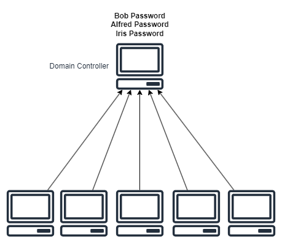

# AWS Directory Services<!-- omit in toc -->

## Contents <!-- omit in toc -->

- [1. What is Microsoft Active Directory (AD)?](#1-what-is-microsoft-active-directory-ad)
- [2. AWS Directory Services](#2-aws-directory-services)

# 1. What is Microsoft Active Directory (AD)?

- Found on any Windows Server with AD Domain Services.
- Database of **objects**: User Accounts, Computers, Printers, File Shares, Security Groups.
- Centralized security management, create account, assign permissions.
- Objects are organized in trees.
- A group of trees is a forest.

# 2. AWS Directory Services

- **AWS Directory Service makes it easy for you to setup and run directories in the AWS cloud, or connect your AWS resources with an existing on-premises Microsoft Active Directory.**
- **AWS Managed Microsoft AD:**
  - Create your own AD in AWS, manage users locally, supports MFA.
  - Establish "trust" connections with your on-premise AD.
- **AD Connector:**
  - Directory Gateway (proxy) to redirect to on-premise AD, supports MFA.
  - Users are managed on the on-premise AD.
- **Simple AD:**
  - AD-compatible managed directory on AWS.
  - Cannot be joined with on-premise AD.

