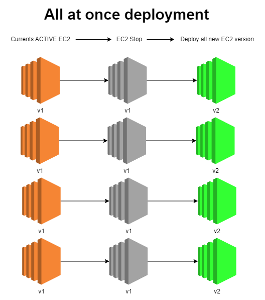
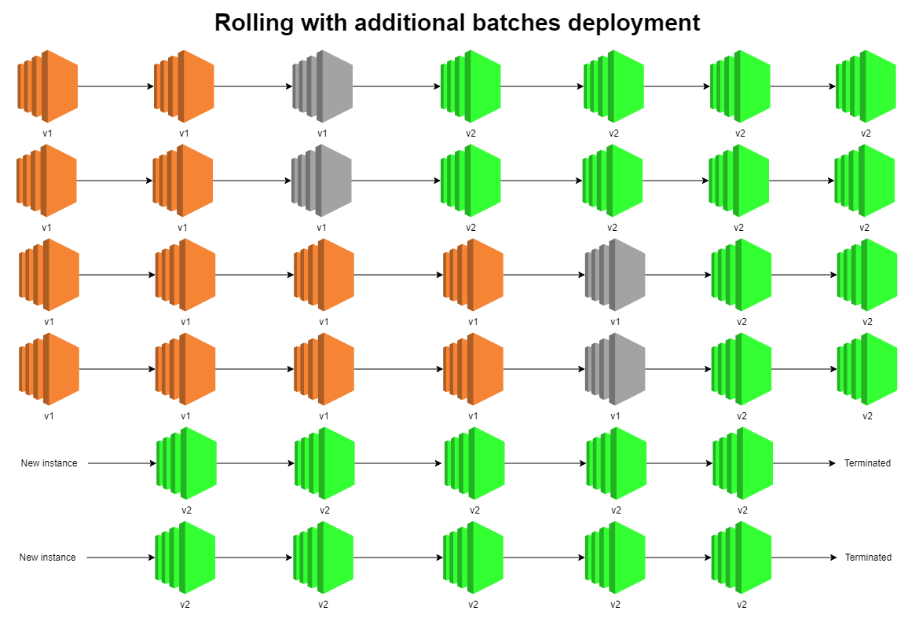
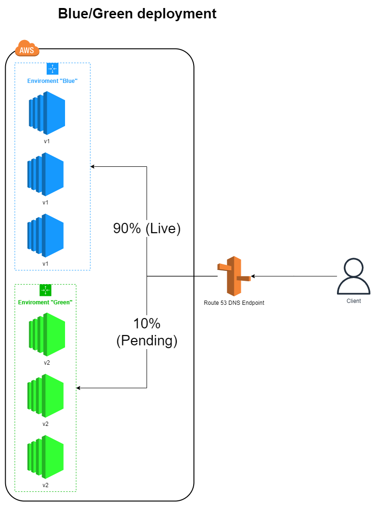

# AWS Elastic Beanstalk <!-- omit in toc -->

## Contents <!-- omit in toc -->

- [1. Developer problems on AWS](#1-developer-problems-on-aws)
- [2. Overview](#2-overview)
- [3. Components](#3-components)
  - [3.1. Supported Platforms](#31-supported-platforms)
- [4. Deployment Options for Updates](#4-deployment-options-for-updates)
  - [4.1. All at once](#41-all-at-once)
  - [4.2. Rolling](#42-rolling)
  - [4.3. Rolling with additional batches](#43-rolling-with-additional-batches)
  - [4.4. Immutable](#44-immutable)
  - [4.5. Blue / Green](#45-blue--green)
  - [4.6. Traffic Splitting](#46-traffic-splitting)
- [5. Elastic Beanstalk CLI](#5-elastic-beanstalk-cli)
- [6. Elastic Beanstalk Deployment Process](#6-elastic-beanstalk-deployment-process)
- [7. Lifecycle Policy](#7-lifecycle-policy)
- [8. Elastic Beanstalk Extensions (Customizations)](#8-elastic-beanstalk-extensions-customizations)
- [9. Under the Hood](#9-under-the-hood)
- [10. Elastic Beanstalk Cloning](#10-elastic-beanstalk-cloning)
- [11. Migration: Load Balancer](#11-migration-load-balancer)
- [12. RDS with Elastic Beanstalk](#12-rds-with-elastic-beanstalk)
  - [12.1. Database lifecycle](#121-database-lifecycle)
  - [12.2. Decouple RDS](#122-decouple-rds)
- [13. Single Docker](#13-single-docker)
  - [13.1. Multi Docker Container](#131-multi-docker-container)
- [14. HTTPS](#14-https)
- [15. Web Server vs Worker Environment](#15-web-server-vs-worker-environment)
- [16. Custom Platform (Advanced)](#16-custom-platform-advanced)

# 1. Developer problems on AWS

- Managing infrastructure.
- Deploying Code.
- Configuring all the databases, load balancers, etc.
- Scaling concerns.
- Most web apps have the same architecture (ALB + ASG).
- All the developers want is for their code to run!
- Possibly, consistently across different applications and environments.

# 2. Overview

- Elastic Beanstalk is a developer centric view of deploying an application on AWS.
- It uses all the component's we've seen before: EC2, ASG, ELB, RDS, ...
- Managed service
  - Automatically handles capacity provisioning, load balancing, scaling, application health monitoring, instance configuration, ...
  - Just the application code is the responsibility of the developer.
- We still have full control over the configuration.
- Beanstalk is free but you pay for the underlying instances.

# 3. Components

- **Application:** Collection of Elastic Beanstalk components (environments, versions, configurations, ...).
- **Application Version:** An iteration of your application code.
- Environment
  - Collection of AWS resources running an application version (only one application version at a time).
  - **Tiers:** Web Server Environment Tier & Worker Environment Tier.
  - You can create multiple environments (dev, test, prod, ...).

## 3.1. Supported Platforms

- Go
- Java SE
- Java with Tomcat
- .NET Core on Linux
- .NET on Windows Server
- Node.js
- PHP
- Python
- Ruby
- Packer Builder
- Single Container Docker
- Multi-container Docker
- Preconfigured Docker
- If not supported, you can write your custom platform (advanced)

# 4. Deployment Options for Updates

- **All at once (deploy all in one go):** Fastest, but instances aren't available to serve traffic for a bit (downtime).
- **Rolling:** Update a few instances at a time (bucket), and then move onto the next bucket once the first bucket is healthy.
- **Rolling with additional batches:** Like rolling, but spins up new instances to move the batch (so that the old application is still available).
- **Immutable:** Spins up new instances in a new ASG, deploys version to these instances, and then swaps all the instances when everything is healthy.
- **Blue Green:** Create a new environment and switch over when ready.
- **Traffic Splitting:** Canary testing - send a small % of traffic to new deployment.

## 4.1. All at once

- Fastest deployment.
- Application has downtime.
- Great for quick iterations in development environment.
- No additional cost.

## 4.2. Rolling

- Application is running **below** capacity.
- Can set the bucket size.
- Application is running both versions simultaneously.
- No additional cost.
- Long deployment.

## 4.3. Rolling with additional batches

- Application is running **at** capacity.
- Can set the bucket size.
- Application is running both versions simultaneously.
- Small additional cost.
- Additional batch is removed at the end of the deployment.
- Longer deployment.
- Good for prod.

## 4.4. Immutable

- **In this mode, a full set of new instances running the new version of the application in a separate Auto Scaling Group is launched. To roll back quickly, this mode terminates the ASG holding the new application version, while the current one is untouched and already running at full capacity.**
- Zero downtime.
- New Code is deployed to new instances on a temporary ASG.
- High cost, double capacity.
- Longest deployment.
- Quick rollback in case of failures (just terminate new ASG).
- Great for prod.

## 4.5. Blue / Green

- Not a "direct feature" of Elastic Beanstalk.
- Zero downtime and release facility.
- Create a new "stage" environment and deploy v2 there.
- The new environment (green) can be validated independently and rollback if issues.
- Route 53 can be setup using weighted policies to redirect a little bit of traffic to the stage environment (CNAMEs).
- Using Beanstalk, "swap URLs" when done with the environment test.

## 4.6. Traffic Splitting

- **Canary Testing.**
- New application version is deployed to a temporary ASG with the same capacity.
- A small % of traffic is sent to the temporary ASG for a configurable amount of time.
- Deployment health is monitored.
- If there's a deployment failure, this triggers an **automated rollback (very quick)**.
- No application downtime.
- New instances are migrated from the temporary to the original ASG.
- Old application version is then terminated.

# 5. Elastic Beanstalk CLI

- We can install an additional CLI called the "EB cli" which makes working with Beanstalk from the CLI easier.
- Basic commands are:
  - `eb create`
  - `eb status`
  - `eb health`
  - `eb events`
  - `eb logs`
  - `eb open`
  - `eb deploy`
  - `eb config`
  - `eb terminate`
- It's helpful for your automated deployment pipelines!

# 6. Elastic Beanstalk Deployment Process

- Describe dependencies (requirements.txt for Python, package.json for Node.js).
- **Package code as ZIP**, and describe dependencies.
  - Python: requirements.txt
  - Node.js: package.json
- **Console:** Upload zip file (creates new app version), and then deploy.
- **CLI:** Create new app version using CLI (uploads zip), and then deploy.
- Elastic Beanstalk will deploy the zip on each EC2 instance, resolve dependencies and start the application.

# 7. Lifecycle Policy

- Elastic Beanstalk can store at most 1000 application versions.
- If you don't remove old versions, you won't be able to deploy anymore.
- To phase out old application versions, use a **lifecycle policy**.
  - Based on time (old versions are removed).
  - Based on space (when you have too many versions).
- Versions that are currently used won't be deleted.
- Option not to delete the source bundle in S3 to prevent data loss.

# 8. Elastic Beanstalk Extensions (Customizations)

- A zip file containing our code must be deployed to Elastic Beanstalk.
- All the parameters set in the UI can be configured with code using files.
- Requirements:
  - In the .ebextensions / directory in the root of source code.
  - YAML / JSON format.
  - **.config** extensions (example: logging.config).
  - Able to modify some default settings using: option_settings.
  - Ability to add resources such as RDS, ElastiCache, DynamoDB, etc...
- Resources managed by .ebextensions get deleted if the environment goes away.

# 9. Under the Hood

- Under the hood, Elastic Beanstalk relies on CloudFormation.
- CloudFormation is used to provision other AWS services.
- Use case: you can define CloudFormation resources in your `.ebextensions` to provision ElastiCache, an S3 bucket, anything you want!

# 10. Elastic Beanstalk Cloning

- Clone an environment with the exact same configuration.
- Useful for deploying a "test" version of your application.
- All resources and configuration are preserved:
  - Load Balancer type and configuration.
  - RDS database type (but the data is not preserved).
  - Environment variables.
- After cloning an environment, you can change settings cloning.

# 11. Migration: Load Balancer

- After creating an Elastic Beanstalk environment, you cannot change the Elastic Load Balancer type (only the configuration).
- To migrate:

  1. Create a new environment with the same configuration except LB (can't clone).
  2. Deploy your application onto the new environment.
  3. Perform a CNAME swap or Route 53 update.

# 12. RDS with Elastic Beanstalk

- RDS can be provisioned with Beanstalk, which is great for dev / test.
- This is not great for prod as the database lifecycle is tied to the Beanstalk environment lifecycle.
- The best for prod is to separately create an RDS database and provide our EB application with the connection string.

## 12.1. Database lifecycle

- You can choose what you want to happen to the database after you decouple it from your Elastic Beanstalk environment.
  - **Snapshot:** Before Elastic Beanstalk terminates the database, it saves a snapshot of it.
  - **Delete:** Elastic Beanstalk terminates the database. After it's terminated, the database instance is no longer available for any operation.
  - **Retain:** The database instance isn't terminated. It remains available and operational, though decoupled from Elastic Beanstalk.

## 12.2. Decouple RDS

1. Create a snapshot of RDS DB (as a safeguard).
2. Go to the RDS console and protect the RDS database from deletion.
3. Create a new Elastic Beanstalk environment, without RDS, point your application to existing RDS.
4. perform a CNAME swap (blue/green) or Route 53 update, confirm working.
5. Terminate the old environment (RDS won't be deleted).
6. Delete CloudFormation stack (in DELETE_FAILED state).

# 13. Single Docker

- Run your application as a single docker container.
- Either provide:
  - **Dockerfile:** Elastic Beanstalk will build and run the Docker container
  - **Dockerrun.aws.json (v1):** Describe where _already built_ Docker image is
    - Image
    - Ports
    - Volumes
    - Logging
    - Etc...
- Beanstalk in Single Docker Container _does not use ECS_.

## 13.1. Multi Docker Container

- Multi Docker helps run multiple containers per EC2 instance in EB.
- This will create for you:
  - ECS Cluster.
  - EC2 instances, configured to use the ECS Cluster.
  - Load Balancer (in high availability mode).
  - Task definitions and execution.
- Requires a config **Dockerrun.aws.json (v2)** at the root of source code.
- **Dockerrun.aws.json** is used to generate the **ECS task definition**.
- Your Docker images must be pre-built and stored in ECR for example.

# 14. HTTPS

- **Beanstalk with HTTPS**
  - Idea: Load the SSL certificate onto the Load Balancer.
  - Can be done from the Console (EB console, load balancer configuration).
  - Can be done from the code: `.ebextensions/securelistener-alb.config`.
  - SSL Certificate can be provisioned using ACM (AWS Certificate Manager) or CLI.
  - Must configure a security group rule to allow incoming port 443 (HTTPS port).
- **Beanstalk redirect HTTP to HTTPS**
  - Configure your instances to redirect HTTP to HTTPS: https://github.com/awsdocs/elastic-beanstalk-samples/tree/master/configuration-files/aws-provided/security-configuration/https-redirect
  - OR configure the Application Load Balancer (ALB only) with a rule.
  - Make sure health checks are not redirected (so they keep giving 200 OK).

# 15. Web Server vs Worker Environment

- If your application performs tasks that are long to complete, offload these tasks to a dedicated **worker environment**.
- **Decoupling** your application into two tiers is common.
- Example: processing a video, generating a zip file, etc.
- You can define periodic tasks in a file `cron.yaml`.

# 16. Custom Platform (Advanced)

- Custom Platforms are very advanced, they allow to define from scratch:
  - The Operating System (OS).
  - Additional Software.
  - Scripts that Beanstalk runs on these platforms.
- Use case: **app language is incompatible with Beanstalk & doesn't use Docker.**
- To create your own platform:
  - Define an AMI using `Platform.yaml` file.
  - Build that platform using the **Packer software (open source tool to create AMIs)**.
- Custom Platform vs Custom Image (AMI):
  - Custom Image is to tweak an existing Beanstalk Platform (Python, Node.js, Java...).
  - Custom Platform is to create an entirely new Beanstalk Platform.
