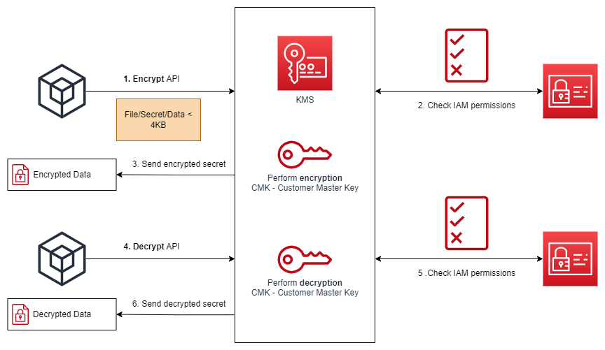
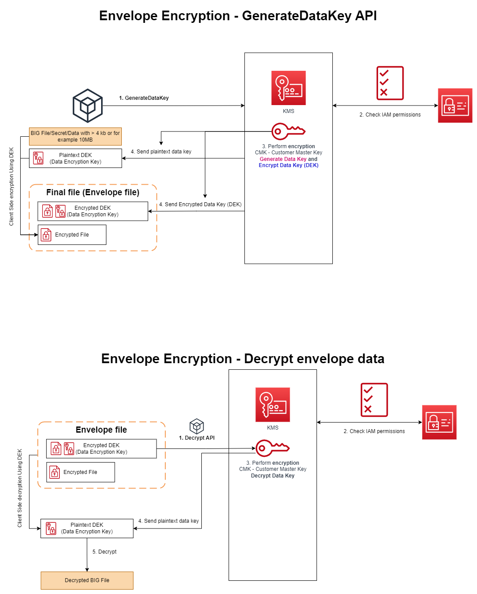

# AWS KMS - Key Management Service<!-- omit in toc -->

## Contents <!-- omit in toc -->

- [1. Why encryption?](#1-why-encryption)
  - [1.1. Encryption in flight (SSL)](#11-encryption-in-flight-ssl)
  - [1.2. Server side encryption at rest](#12-server-side-encryption-at-rest)
  - [1.3. Client side encryption](#13-client-side-encryption)
- [2. AWS KMS (Key Management Service)](#2-aws-kms-key-management-service)
  - [2.1. KMS Keys Types](#21-kms-keys-types)
  - [2.2. Types of KMS Keys](#22-types-of-kms-keys)
  - [2.3. Key Policies](#23-key-policies)
  - [2.4. Copying Snapshots across accounts](#24-copying-snapshots-across-accounts)
  - [2.5. How does KMS work? API – Encrypt and Decrypt](#25-how-does-kms-work-api--encrypt-and-decrypt)
  - [2.6. Envelope Encryption](#26-envelope-encryption)
    - [2.6.1. Encryption SDK](#261-encryption-sdk)
    - [2.6.2. Diagram](#262-diagram)
  - [2.7. KMS Symmetric - API Summary](#27-kms-symmetric---api-summary)
- [3. Request Quotas](#3-request-quotas)
- [4. S3 Bucket Key for SSE-KMS encryption](#4-s3-bucket-key-for-sse-kms-encryption)
- [5. CloudHSM](#5-cloudhsm)
  - [5.1. Diagram](#51-diagram)
  - [5.2. High Availability](#52-high-availability)
  - [5.3. Integration with AWS Services](#53-integration-with-aws-services)
- [6. SSM Parameter Store](#6-ssm-parameter-store)
  - [6.1. Store Hierarchy](#61-store-hierarchy)
  - [6.2. Parameters Policies (for advanced parameters)](#62-parameters-policies-for-advanced-parameters)
- [7. AWS Secrets Manager](#7-aws-secrets-manager)
  - [7.1. Secrets Manager CloudFormation Integration RDS \& Aurora](#71-secrets-manager-cloudformation-integration-rds--aurora)
  - [7.2. SSM Parameter Store vs Secrets Manager](#72-ssm-parameter-store-vs-secrets-manager)
- [8. CloudWatch Logs - Encryption](#8-cloudwatch-logs---encryption)
- [9. CodeBuild Security](#9-codebuild-security)
- [10. AWS Nitro Enclaves](#10-aws-nitro-enclaves)

# 1. Why encryption?

## 1.1. Encryption in flight (SSL)

- Data is encrypted before sending and decrypted after receiving.
- SSL certificates help with encryption (HTTPS).
- Encryption in flight ensures no MITM (man in the middle attack) can happen.

## 1.2. Server side encryption at rest

- Data is encrypted after being received by the server.
- Data is decrypted before being sent.
- It is stored in an encrypted form thanks to a key (usually a data key).
- The encryption / decryption keys must be managed somewhere and the server must have access to it.

## 1.3. Client side encryption

- Data is encrypted by the client and never decrypted by the server.
- Data will be decrypted by a receiving client.
- The server should not be able to decrypt the data.
- Could leverage Envelope Encryption.

# 2. AWS KMS (Key Management Service)

- Anytime you hear "encryption" for an AWS service, it's most likely KMS.
- AWS manages encryption keys for us.
- Fully integrated with IAM for authorization.
- Easy way to control access to your data.
- Able to audit KMS Key usage using CloudTrail.
- Seamlessly integrated into most AWS services (EBS, S3, RDS, SSM...).
- **Never ever store your secrets in plaintext, especially in your code!**
  - KMS Key Encryption also available through API calls (SDK, CLI).
  - Encrypted secrets can be stored in the code / environment variables.

## 2.1. KMS Keys Types

- **KMS Keys is the new name of KMS Customer Master Key (CMK).**
- **Symmetric (AES-256 keys)**
  - Single encryption key that is used to Encrypt and Decrypt.
  - AWS services that are integrated with KMS use Symmetric CMKs.
  - You never get access to the KMS Key unencrypted (must call KMS API to use).
- **Asymmetric (RSA & ECC key pairs)**
  - Public (Encrypt) and Private Key (Decrypt) pair.
  - Used for Encrypt/Decrypt, or Sign/Verify operations.
  - The public key is downloadable, but you can't access the Private Key unencrypted.
  - Use case: encryption outside of AWS by users who can't call the KMS API.

## 2.2. Types of KMS Keys

- Types of KMS Keys:
  - AWS Owned Keys (free): SSE-S3, SSE-SQS, SSE-DDB (default key).
  - AWS Managed Key: **free** (aws/service-name, example: aws/rds or aws/ebs).
  - Customer managed keys created in KMS.
  - Customer managed keys imported (must be symmetric key).
- **Automatic Key rotation**
  - AWS-managed KMS Key: automatic every 1 year.
  - Customer-managed KMS Key: (must be enabled) automatic every 1 year.
  - Imported KMS Key: only manual rotation possible using alias.

| Type of KMS key      | Can view KMS key metadata | Can manage KMS key | Used only for my AWS account | Automatic rotation                            | Pricing                                                             |
| -------------------- | ------------------------- | ------------------ | ---------------------------- | --------------------------------------------- | ------------------------------------------------------------------- |
| Customer managed key | Yes                       | Yes                | Yes                          | Optional. Every year (approximately 365 days) | Monthly fee (pro-rated hourly) Per-use fee                          |
| AWS managed key      | Yes                       | No                 | Yes                          | Required. Every year (approximately 365 days) | No monthly fee Per-use fee (some AWS services pay this fee for you) |
| AWS owned key        | No                        | No                 | No                           | Varies                                        | No fees                                                             |

## 2.3. Key Policies

- Control access to KMS keys, "similar" to S3 bucket policies.
- Difference: you cannot control access without them.
- **Default KMS Key Policy**
  - Created if you don't provide a specific KMS Key Policy.
  - Complete access to the key to the root user = entire AWS account.
- **Custom KMS Key Policy**
  - Define users, roles that can access the KMS key.
  - Define who can administer the key.
  - Useful for cross-account access of your KMS key.

## 2.4. Copying Snapshots across accounts

1. Create a Snapshot, encrypted with your own KMS Key (Customer Managed Key).
2. Attach a KMS Key Policy to authorize cross-account access.
3. Share the encrypted snapshot.
4. (in target) Create a copy of the Snapshot, encrypt it with a CMK in your account.
5. Create a volume from the snapshot KMS Key Policy.

## 2.5. How does KMS work? API – Encrypt and Decrypt

## 2.6. Envelope Encryption

- KMS Encrypt API call has a **limit of 4 KB**.
- If you want to encrypt >4 KB, we need to use Envelope Encryption.
- The main API that will help us is the GenerateDataKey API.
- **Anything over 4 KB of data that needs to be encrypted must use the Envelope Encryption == `GenerateDataKey` API.**

### 2.6.1. Encryption SDK

- The AWS Encryption SDK implemented Envelope Encryption for us.
- The Encryption SDK also exists as a CLI tool we can install.
- Implementations for Java, Python, C, JavaScript.
- Feature - Data Key Caching:
  - Re-use data keys instead of creating new ones for each encryption.
  - Helps with reducing the number of calls to KMS with a security trade-off.
  - Use LocalCryptoMaterialsCache (max age, max bytes, max number of messages).

### 2.6.2. Diagram

- The SDK encrypts the data encryption key and stores it (encrypted) as part of the returned ciphertext.

## 2.7. KMS Symmetric - API Summary

- `Encrypt` - Encrypt **up to 4 KB** of data through KMS.
- `GenerateDataKey`
  - Generates a unique symmetric data key (DEK).
  - Returns a plaintext copy of the data key **AND** a copy that is encrypted under the CMK that you specify.
- `GenerateDataKeyWithoutPlaintext`
  - Generate a DEK to use at some point (not immediately).
  - DEK that is encrypted under the CMK that you specify (must use Decrypt later).
- `Decrypt` - Decrypt **up to 4 KB** of data (including Data Encryption Keys).
- `GenerateRandom` - Returns a random byte string.

# 3. Request Quotas

- When you exceed a request quota, you get a `ThrottlingException`:
  - **You have exceeded the rate at which you may call KMS. Reduce the frequency of your calls. (Service: AWSKMS; Status code: 400; Error Code: ThrottlingException); Request ID: <ID>**.
- To respond, use **exponential backoff** (backoff and retry).
- For cryptographic operations, they share a quota.
- This includes requests made by AWS on your behalf (ex: SSE-KMS).
- For GenerateDataKey, consider using DEK caching from the Encryption SDK.
- **You can request a Request Quotas increase through API or AWS support.**

# 4. S3 Bucket Key for SSE-KMS encryption

- New setting to decrease...
  - Number of API calls made to KMS from S3 by 99%.
  - Costs of overall KMS encryption with Amazon S3 by 99%.
- This leverages data keys
  - A "S3 bucket key" is generated.
  - That key is used to encrypt KMS objects with new data keys.
- You will see **less KMS CloudTrail events in CloudTrail**.

# 5. CloudHSM

- KMS => AWS manages the software for encryption.
- CloudHSM => AWS provisions encryption **hardware**.
- Dedicated Hardware (HSM = Hardware Security Module).
- You manage your own encryption keys entirely (not AWS).
- HSM device is tamper resistant, FIPS 140-2 Level 3 compliance.
- Supports both symmetric and **asymmetric** encryption (SSL/TLS keys).
- No free tier available.
- Must use the CloudHSM Client Software.
- Redshift supports CloudHSM for database encryption and key management.
- **Good option to use with SSE-C encryption.**

## 5.1. Diagram

- IAM permissions:
  - CRUD an HSM Cluster
- CloudHSM Software:
  - Manage the Keys
  - Manage the Users

## 5.2. High Availability

- CloudHSM clusters are spread across Multi AZ (HA)
- Great for availability and durability

## 5.3. Integration with AWS Services

- Through integration with AWS KMS
- Configure KMS Custom Key Store with CloudHSM
- Example: EBS, S3, RDS ...

# 6. SSM Parameter Store

- Secure storage for configuration and secrets.
- Optional Seamless Encryption using KMS.
- Serverless, scalable, durable, easy SDK.
- Version tracking of configurations / secrets.
- Security through IAM.
- Notifications with Amazon EventBridge.
- Integration with CloudFormation.

## 6.1. Store Hierarchy

- Examples:
- /my-department/
  - my-app/
    - dev/
      - db-url
      - db-password
    - prod/
      - db-url
      - db-password
  - other-app/
- /other-department/
- /aws/reference/secretsmanager/secret_ID_in_Secrets_Manager
- /aws/service/ami-amazon-linux-latest/amzn2-ami-hvm-x86_64-gp2 (public)

## 6.2. Parameters Policies (for advanced parameters)

- Allow to assign a TTL to a parameter (expiration date) to force updating or deleting sensitive data such as passwords.
- Can assign multiple policies at a time.

# 7. AWS Secrets Manager

- Newer service, meant for storing secrets.
- Capability to force **rotation of secrets** every X days.
- Automate generation of secrets on rotation (uses Lambda).
- Integration with **Amazon RDS** (MySQL, PostgreSQL, Aurora).
- Secrets are encrypted using KMS.
- Mostly meant for RDS integration.

## 7.1. Secrets Manager CloudFormation Integration RDS & Aurora

- ManageMasterUserPassword - creates admin secret implicitly.
- RDS, Aurora will manage the secret in Secrets Manager and its rotation.

## 7.2. SSM Parameter Store vs Secrets Manager

- **Secrets Manager ($$$)**
  - Automatic rotation of secrets with AWS Lambda.
  - Lambda function is provided for RDS, Redshift, DocumentDB.
  - KMS encryption is mandatory.
  - Can integration with CloudFormation.
- **SSM Parameter Store ($)**
  - Simple API.
  - No secret rotation (can enable rotation using Lambda triggered by CW Events).
  - KMS encryption is optional.
  - Can integration with CloudFormation.
  - Can pull a Secrets Manager secret using the SSM Parameter Store API.

# 8. CloudWatch Logs - Encryption

- You can encrypt CloudWatch logs with KMS keys.
- Encryption is enabled at the log group level, by associating a CMK with a log group, either when you create the log group or after it exists.
- You cannot associate a CMK with a log group using the CloudWatch console.
- You must use the CloudWatch Logs API:
  - `associate-kms-key`: if the log group already exists.
  - `create-log-group`: if the log group doesn't exist yet.

# 9. CodeBuild Security

- To access resources in your VPC, make sure you specify a VPC configuration for your CodeBuild.
- Secrets in CodeBuild:
- Don't store them as plaintext in environment variables.
- Instead...
  - Environment variables can reference parameter store parameters.
  - Environment variables can reference secrets manager secrets.

# 10. AWS Nitro Enclaves

- Process highly sensitive data in an isolated compute environment
  - Personally Identifiable Information (PII), healthcare, financial, ...
- Fully isolated virtual machines, hardened, and highly constrained
  - Not a container, not persistent storage, no interactive access, no external networking.
- Helps reduce the attack surface for sensitive data processing apps
  - Cryptographic Attestation - only authorized code can be running in your Enclave.
  - Only Enclaves can access sensitive data (integration with KMS).
- Use cases: securing private keys, processing credit cards, secure multi-party computation...
