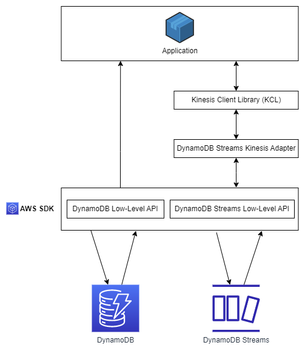
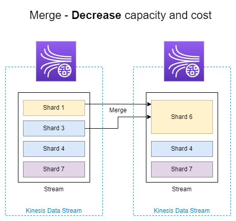

# AWS Kinesis<!-- omit in toc -->

## Contents <!-- omit in toc -->

- [1. Introduction](#1-introduction)
- [2. Kinesis Data Streams](#2-kinesis-data-streams)
  - [2.1. Capacity Modes](#21-capacity-modes)
  - [2.2. Security](#22-security)
  - [2.3. Producers](#23-producers)
  - [2.4. Consumers](#24-consumers)
    - [Scaling Consumers](#scaling-consumers)
    - [2.4.1. Consumers Types](#241-consumers-types)
  - [2.5. AWS Lambda](#25-aws-lambda)
- [3. Kinesis Client Library (KCL)](#3-kinesis-client-library-kcl)
- [4. Kinesis Adapter](#4-kinesis-adapter)
- [5. Kinesis Operation](#5-kinesis-operation)
  - [5.1. Shard](#51-shard)
  - [5.2. Shard Splitting](#52-shard-splitting)
  - [5.3. Merging Shards](#53-merging-shards)
- [6. Kinesis Data Firehose](#6-kinesis-data-firehose)
  - [6.1. Kinesis Data Streams vs Firehose](#61-kinesis-data-streams-vs-firehose)
- [7. Kinesis Data Analytics (SQL application)](#7-kinesis-data-analytics-sql-application)
  - [7.1. Kinesis Data Analytics for Apache Flink](#71-kinesis-data-analytics-for-apache-flink)
- [8. Ordering data into](#8-ordering-data-into)
  - [8.1. Kinesis](#81-kinesis)
  - [8.2. SQS](#82-sqs)
  - [8.3. Kinesis vs SQS ordering](#83-kinesis-vs-sqs-ordering)
- [9. SQS vs SNS vs Kinesis](#9-sqs-vs-sns-vs-kinesis)

# 1. Introduction

- Makes it easy to **collect**, **process**, and **analyze** streaming data in real-time.
- Ingest real-time data such as: Application logs, Metrics, Website clickstreams, IoT telemetry data...
- **Kinesis Data Streams:** Capture, process, and store data streams.
- **Kinesis Data Firehose:** Load data streams into AWS data stores.
- **Kinesis Data Analytics:** Analyze data streams with SQL or Apache Flink.
- **Kinesis Video Streams:** Capture, process, and store video streams.

# 2. Kinesis Data Streams

- Retention between 1 day to 365 days.
  - Default 24 hours.
- Ability to reprocess (replay) data.
- Once data is inserted in Kinesis, it can't be deleted (immutability).
- Data that shares the same partition goes to the same shard (ordering).
- Producers: AWS SDK, Kinesis Producer Library (KPL), Kinesis Agent.
- Consumers:
  - Write your own: Kinesis Client Library (KCL), AWS SDK.
  - Managed: AWS Lambda, Kinesis Data Firehose, Kinesis Data Analytics.

## 2.1. Capacity Modes

- **Provisioned mode**
  - You choose the number of shards provisioned, scale manually or using API.
  - Each shard gets 1MB/s in (or 1000 records per second).
  - Each shard gets 2MB/s out (classic or enhanced fan-out consumer).
  - You pay per shard provisioned per hour.
- **On-demand mode**
  - No need to provision or manage the capacity.
  - Default capacity provisioned (4 MB/s in or 4000 records per second).
  - Scales automatically based on observed throughput peak during the last 30 days.
  - Pay per stream per hour & data in/out per GB.

## 2.2. Security

- Control access / authorization using IAM policies.
- Encryption in flight using HTTPS endpoints.
- Encryption at rest using KMS.
- You can implement encryption/decryption of data on client side (harder).
- VPC Endpoints available for Kinesis to access within VPC.
- Monitor API calls using CloudTrail.

## 2.3. Producers

- Puts data records into data streams.
- Data record consists of:
  - Sequence number (unique per partition-key within shard).
  - Partition key (must specify while put records into stream).
  - Data blob (up to 1 MB).
- Producers:
  - **AWS SDK:** Simple producer.
  - **Kinesis Producer Library (KPL):** C++, Java, batch, compression, retries.
  - **Kinesis Agent:** Monitor log files.
- Write throughput: 1 MB/sec or 1000 records/sec per shard.
- There are two API calls available for writing records to a Kinesis Data Stream: `PutRecord` or `PutRecords`.
  - `PutRecord` writes a single record to the stream
  - While `PutRecords` writes multiple records to the stream in a batch.
  - Kinesis Data Streams attempts to process all records in each `PutRecords` request.
  - A single record failure does not stop the processing of subsequent records.
  - As a result, `PutRecords` doesn't guarantee the ordering of records.
    - If you need to read records in the same order they are written to the stream, use `PutRecord` along with the `SequenceNumberForOrdering` parameter.

## 2.4. Consumers

- Get data records from data streams and process them
- AWS Lambda
- Kinesis Data Analytics
- Kinesis Data Firehose
- Custom Consumer (AWS SDK) - Classic or Enhanced Fan-Out
- Kinesis Client Library (KCL): Library to simplify reading from data stream

### Scaling Consumers

- `GetRecords.IteratorAgeMilliseconds` (CloudWatch Metric).
  - The difference between current time and when the last record of the `GetRecords` call was written to the stream.
  - Used to track the progress of Kinesis Consumers (tracks the read position).
  - `IteratorAgeMilliseconds` = 0, then records being read are completely caught up with the Stream.
  - `IteratorAgeMilliseconds` > 0 means we’re not processing the records fast enough.

### 2.4.1. Consumers Types

| Shared (Classic) Fan-out Consumer - pull                                 | Enhanced Fan-out Consumer - push                                      |
| ------------------------------------------------------------------------ | --------------------------------------------------------------------- |
| Low number of consuming applications                                     | Multiple consuming applications for the same stream                   |
| Read throughput: 2 MB/sec per shard across all consumers                 | 2 MB/sec per consumer per shard                                       |
| Max. 5 GetRecords API calls/sec                                          | Latency ~70 ms                                                        |
| Latency ~200 ms                                                          | Higher costs ($$$)                                                    |
| Minimize cost ($)                                                        | Kinesis pushes data to consumers over HTTP/2 (SubscribeToShard API)   |
| Consumers poll data from Kinesis using GetRecords API call               | Soft limit of 5 consumer applications (KCL) per data stream (default) |
| Returns up to 10 MB (then throttle for 5 seconds) or up to 10000 records |                                                                       |

## 2.5. AWS Lambda

- Supports Classic & Enhanced fan-out consumers.
- Read records in batches.
- Can configure batch size and batch window.
- If error occurs, Lambda retries until succeeds or data expired.
- Can process up to 10 batches per shard simultaneously.

# 3. Kinesis Client Library (KCL)

- A Java library that helps read record from a Kinesis Data Stream with distributed applications sharing the read workload.
- Each shard is to be read by only one KCL instance:
  - 4 shards = max. 4 KCL instances.
  - 6 shards = max. 6 KCL instances.
- Progress is checkpointed into DynamoDB (needs IAM access).
- Track other workers and share the work amongst shards using DynamoDB.
- KCL can run on EC2, Elastic Beanstalk, and on-premises.
- Records are read in order at the shard level.
- Versions:
  - KCL 1.x (supports shared consumer).
  - KCL 2.x (supports shared & enhanced fan-out consumer).

# 4. Kinesis Adapter

- Using the Amazon Kinesis Adapter is the recommended way to consume streams from Amazon DynamoDB.
- You can write applications for Kinesis Data Streams using the Kinesis Client Library (KCL).

# 5. Kinesis Operation

## 5.1. Shard

- 1 Shard = Capture 1 MB / Distribution 2 MB

## 5.2. Shard Splitting

- Used to increase the Stream capacity (1 MB/s data in per shard)
- Used to divide a "hot shard"
- The old shard is closed and will be deleted once the data is expired
- No automatic scaling (manually increase/decrease capacity)
- Can't split into more than two shards in a single operation

## 5.3. Merging Shards

- Decrease the Stream capacity and save costs.
- Can be used to group two shards with low traffic (cold shards).
- Old shards are closed and will be deleted once the data is expired.
- Can't merge more than two shards in a single operation.

# 6. Kinesis Data Firehose

- Fully Managed Service, no administration, automatic scaling, serverless.
  - AWS:
    - Redshift
    - Amazon S3
    - OpenSearch (Elasticsearch)
  - 3rd party partner: Splunk / MongoDB / DataDog / NewRelic / ...
  - Custom: send to any HTTP endpoint.
- Pay for data going through Firehose.
- **Near Real Time.**
  - 60 seconds latency minimum for non full batches.
  - Or minimum 1 MB of data at a time.
- Supports many data formats, conversions, transformations, compression.
- Supports custom data transformations using AWS Lambda.
- Can send failed or all data to a backup S3 bucket.

## 6.1. Kinesis Data Streams vs Firehose

| Kinesis Data Streams                       | Kinesis Data Firehose                                                         |
| ------------------------------------------ | ----------------------------------------------------------------------------- |
| Streaming service for ingest at scale      | Load streaming data into S3 / Redshift / OpenSearch / 3rd party / custom HTTP |
| Write custom code (producer / consumer)    | Fully managed                                                                 |
| Real-time (~200 ms)                        | Near real-time (buffer time min. 60 sec)                                      |
| Manage scaling (shard splitting / merging) | Automatic scaling                                                             |
| Data storage for 1 to 365 days             | No data storage                                                               |
| Supports replay capability                 | Doesn't support replay capability                                             |

# 7. Kinesis Data Analytics (SQL application)

- Real-time analytics on **Kinesis Data Streams & Firehose** using SQL.
- Add reference data from Amazon S3 to enrich streaming data.
- Fully managed, no servers to provision.
- Automatic scaling.
- Pay for actual consumption rate.
- **Output:**
  - Kinesis Data Streams: create streams out of the real-time analytics queries.
  - Kinesis Data Firehose: send analytics query results to destinations.
- **Use cases:**
  - Time-series analytics.
  - Real-time dashboards.
  - Real-time metrics.

## 7.1. Kinesis Data Analytics for Apache Flink

- Use Flink (Java, Scala or SQL) to process and analyze streaming data.
- Run any Apache Flink application on a managed cluster on AWS:
  - Provisioning compute resources, parallel computation, automatic scaling.
  - Application backups (implemented as checkpoints and snapshots).
  - Use any Apache Flink programming features.
  - Flink does not read from Firehose (use Kinesis Analytics for SQL instead).

# 8. Ordering data into

## 8.1. Kinesis

- Imagine you have 100 trucks (truck_1, truck_2, ... truck_100) on the road sending their GPS positions regularly into AWS.
- You want to consume the data in order for each truck, so that you can track their movement accurately.
- How should you send that data into Kinesis?
  - Answer: send using a "Partition Key" value of the "truck_id".
  - The same key will always go to the same shard.

## 8.2. SQS

- For SQS standard, there is no ordering.
- For SQS FIFO, if you don't use a Group ID, messages are consumed in the order they are sent, **with only one consumer**.
- You want to scale the number of consumers, but you want messages to be "grouped" when they are related to each other.
- Then you use a Group ID (similar to Partition Key in Kinesis).

## 8.3. Kinesis vs SQS ordering

- **Let's assume 100 trucks, 5 kinesis shards, 1 SQS FIFO.**
- Kinesis Data Streams:
  - On average you'll have 20 trucks per shard.
  - Trucks will have their data ordered within each shard.
  - The maximum amount of consumers in parallel we can have is 5.
  - Can receive up to 5 MB/s of data.
- SQS FIFO
  - You only have one SQS FIFO queue.
  - You will have 100 Group ID.
  - You can have up to 100 Consumers (due to the 100 Group ID).
  - You have up to 300 messages per second (or 3000 if using batching).

# 9. SQS vs SNS vs Kinesis

| SQS                                             | SNS                                                   | Kinesis                                                   |
| ----------------------------------------------- | ----------------------------------------------------- | --------------------------------------------------------- |
| Consumer "pull data"                            | Push data to many subscribers                         | Standard: pull data - 2 MB per shard                      |
| Data is deleted after being consumed            | Up to 12,500,000 subscribers                          | Enhanced-fan out: push data - 2 MB per shard per consumer |
| Can have as many workers (consumers) as we want | Data is not persisted (lost if not delivered)         | Possibility to replay data                                |
| No need to provision throughput                 | Pub/Sub                                               | Meant for real-time big data, analytics and ETL           |
| Ordering guarantees only on FIFO queues         | Up to 100,000 topics                                  | Ordering at the shard level                               |
| Individual message delay capability             | No need to provision throughput                       | Data expires after X days                                 |
|                                                 | Integrates with SQS for fan- out architecture pattern | Provisioned mode or on-demand capacity mode               |
|                                                 | FIFO capability for SQS FIFO                          |                                                           |
