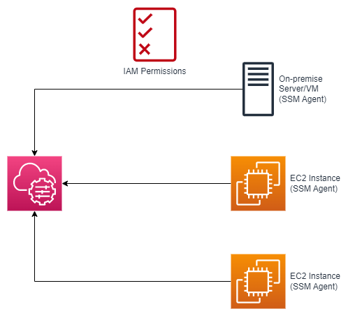

# AWS Systems Manager<!-- omit in toc -->

## Contents <!-- omit in toc -->

- [1. Introduction](#1-introduction)
  - [1.1. How Systems Manager works?](#11-how-systems-manager-works)
  - [1.2. Systems Manager - SSM Session Manager](#12-systems-manager---ssm-session-manager)
- [2. Systems Manager parameters - SSM parameters](#2-systems-manager-parameters---ssm-parameters)
  - [2.1. Policies](#21-policies)
- [3. SSM - Documents](#3-ssm---documents)
- [4. SSM - Run Command](#4-ssm---run-command)
- [5. SSM - Automation](#5-ssm---automation)
- [6. SSM - Parameter Store](#6-ssm---parameter-store)
- [7. SSM Parameter Store Hierarchy](#7-ssm-parameter-store-hierarchy)
- [8. Parameters Policies (for advanced parameters)](#8-parameters-policies-for-advanced-parameters)
- [9. SSM - Patch Manager](#9-ssm---patch-manager)
- [10. SSM - Patch Manager](#10-ssm---patch-manager)
- [11. SSM - Patch Manager Patch Baselines](#11-ssm---patch-manager-patch-baselines)
- [12. SSM - Maintenance Windows](#12-ssm---maintenance-windows)
- [13. SSM - Session Manager](#13-ssm---session-manager)
- [14. SSM - Session Manager](#14-ssm---session-manager)
- [15. Systems Manager - Default Host Management Configuration](#15-systems-manager---default-host-management-configuration)
- [16. Systems Manager - Hybrid Environments](#16-systems-manager---hybrid-environments)
- [17. IoT Greengrass Instance Activation](#17-iot-greengrass-instance-activation)
- [18. Systems Manager - Compliance](#18-systems-manager---compliance)
- [19. Systems Manager - OpsCenter](#19-systems-manager---opscenter)

# 1. Introduction

- Helps you manage your **EC2 and On-Premises** systems at scale.
- Another Hybrid AWS service.
- Get operational insights about the state of your infrastructure.
- Easily detect problems.
- Most important features are:
  - Patching automation for enhanced compliance.
  - Run commands across an entire fleet of servers.
  - Store parameter configuration with the SSM Parameter Store.
- Works for both Windows and Linux OS.
- Integrated with AWS Config.
- Free service.

## 1.1. How Systems Manager works?

- We need to install the **SSM Agent** onto the systems we control.
- Installed by default on Amazon Linux AMI & some Ubuntu AMI.
- If an instance can't be controlled with SSM, it's probably an issue with the **SSM Agent**!
- Thanks to the **SSM Agent**, we can run commands, patch & configure our servers.

## 1.2. Systems Manager - SSM Session Manager

- Allows you to start a secure shell on your EC2 and on-premises servers.
- No SSH access, bastion hosts, or SSH keys needed.
- No port 22 needed (better security).
- Supports Linux, macOS, and Windows.
- Send session log data to S3 or CloudWatch Logs.

# 2. Systems Manager parameters - SSM parameters

## 2.1. Policies

- Parameter policies help you manage a growing set of parameters by allowing you to assign specific criteria to a parameter, such as an expiration date or time to live.
- Parameter policies are especially helpful in forcing you to update or delete passwords and configuration data stored in Parameter Store, a capability of AWS Systems Manager.
- Take note that parameter policies are only available for parameters in the **Advanced tier**.
- Parameter Store offers the following types of policies:
  - `Expiration` - deletes the parameter at a specific date
  - `ExpirationNotification` - sends an event to Amazon EventBridge when the specified expiration time is reached.
  - `NoChangeNotification` - sends an event to Amazon EventBridge when a parameter has not been modified for a specified period of time.

# 3. SSM - Documents

- Documents can be in JSON or YAML.
- You define parameters.
- You define actions.
- Many documents already exist in AWS.

# 4. SSM - Run Command

- Execute a document (= script) or just run a command.
- Run command across multiple instances (using resource groups).
- Rate Control / Error Control.
- Integrated with IAM & CloudTrail.
- No need for SSH.
- Command Output can be shown in the Console, sent to S3 bucket or CloudWatch Logs.
- Send notifications to SNS about command statues (In progress, Success, Failed...).
- Can be invoked using EventBridge.

# 5. SSM - Automation

- Simplifies common maintenance and deployment tasks of EC2 instances and other AWS resources.
- Example: restart instances, create an AMI, EBS snapshot.
- **Automation Runbook**
  - SSM Documents of type Automation.
  - Defines actions preformed on your EC2 instances or AWS resources.
  - Pre-defined runbooks (AWS) or create custom runbooks.
- Can be triggered
  - Manually using AWS Console, AWS CLI or SDK.
  - By Amazon EventBridge.
  - On a schedule using Maintenance Windows.
  - By AWS Config for rules remediations.

# 6. SSM - Parameter Store

- Secure storage for configuration and secrets.
- Optional Seamless Encryption using KMS.
- Serverless, scalable, durable, easy SDK.
- Version tracking of configurations / secrets.
- Security through IAM.
- Notifications with Amazon EventBridge.
- Integration with CloudFormation.

# 7. SSM Parameter Store Hierarchy

- /my-department/
  - my-app/
    - dev/
      - db-url
      - db-password
    - prod/
      - db-url
      - db-password
  - other-app/
- /other-department/
- /aws/reference/secretsmanager/secret_ID_in_Secrets_Manager
- /aws/service/ami-amazon-linux-latest/amzn2-ami-hvm-x86_64-gp2 (public)

# 8. Parameters Policies (for advanced parameters)

- Allow to assign a TTL to a parameter (expiration date) to force updating or deleting sensitive data such as passwords.
- Can assign multiple policies at a time.

# 9. SSM - Patch Manager

- Automates the process of patching managed instances
- OS updates, applications updates, security updates...
- Supports both EC2 instances and on-premises servers
- Supports Linux, macOS, and Windows
- Patch on-demand or on a schedule using Maintenance Windows
- Scan instances and generate patch compliance report (missing patches)
- Patch compliance report can be sent to S3

# 10. SSM - Patch Manager

- **Patch Baseline**
  - Defines which patches should and shouldn't be installed on your instances
  - Ability to create custom Patch Baselines (specify approved/rejected patches)
  - Patches can be auto-approved within days of their release
  - By default, install only critical patches and patches related to security
- **Patch Group**
  - Associate a set of instances with a specific Patch Baseline
  - Example: create Patch Groups for different environments (dev, test, prod)
  - Instances should be defined with the tag key Patch Group
  - An instance can only be in one Patch Group
  - Patch Group can be registered with only one Patch Baseline

# 11. SSM - Patch Manager Patch Baselines

- **Pre-Defined Patch Baseline**
  - Managed by AWS for different Operating Systems (can't be modified).
  - **AWS-RunPatchBaseline (SSM Document):** Apply both operating system and application patches (Linux, macOS, Windows Server).
- **Custom Patch Baseline**
  - Create your own Patch Baseline and choose which patches to auto-approve.
  - Operating System, allowed patches, rejected patches...
  - Ability to specify custom and alternative patch repositories.

# 12. SSM - Maintenance Windows

- Defines a schedule for when to perform actions on your instances.
- Example: OS patching, updating drivers, installing software...
- Maintenance Window contains:
  - Schedule.
  - Duration.
  - Set of registered instances.
  - Set of registered tasks.

# 13. SSM - Session Manager

- Allows you to start a secure shell on your EC2 and on-premises servers.
- Access through AWS Console, AWS CLI, or Session Manager SDK.
- **Does not need SSH access, bastion hosts, or SSH keys.**
- Supports Linux, macOS, and Windows.
- Log connections to your instances and executed commands.
- Session log data can be sent to S3 or CloudWatch Logs.
- CloudTrail can intercept `StartSession` events.

# 14. SSM - Session Manager

- IAM Permissions
  - Control which users/groups can access Session Manager and which instances.
  - Use tags to restrict access to only specific EC2 instances
  - Access SSM + write to S3 + write to CloudWatch
- Optionally, you can restrict commands a user can run in a session

# 15. Systems Manager - Default Host Management Configuration

- When enabled, it automatically configure your EC2 instances as managed instances **without the use of EC2 Instance Profile**.
- **Instance Identity Role:** A type of IAM Role **with no permissions** beyond identifying the EC2 instance to AWS Services (e.g., Systems Manager).
- EC2 instances must have **IMDSv2 enabled** and **SSM Agent installed (doesn't support IMDSv1)**.
- Automatically enables Session Manager, Patch Manager, and Inventory.
- Automatically keeps the SSM Agent up to date.
- Must be enabled per AWS Region.

# 16. Systems Manager - Hybrid Environments

- You can setup Systems Manager to manage on-premises servers, IoT devices, edge devices, and virtual machines (e.g., VMs in other cloud providers).
- In Systems Manager Console, EC2 instances use the prefix "i-" and hybrid managed nodes use the prefix "mi-"

# 17. IoT Greengrass Instance Activation

- Manage IoT Greengrass Core devices using SSM.
- Install SSM Agent on Greengrass Core devices (registered as a managed node in SSM).
- SSM Agent can be installed manually or deployed as a Greengrass Component (pre-built software module that you deploy directly to Greengrass Core devices).
- You must add permissions to the Token Exchange Role (IAM Role for the IoT core device) to communicate with Systems Manager.
- Supports all SSM Capabilities (Patch Manager, Session Manager, Run Command...).
- Use cases: easily update and maintain OS and software updates across a fleet of Greengrass Core devices.

# 18. Systems Manager - Compliance

- Scan your fleet of managed nodes for patch compliance and configuration inconsistencies.
- Displays current data about:
  - **Patches in Patch Manager.**
  - **Associations in State Manager.**
- Can sync data to an S3 bucket using **Resource Data Sync**, and you can analyze using Athena and QuickSight.
- Can collect and aggregate data from multiple accounts and regions.
- Can send compliance data to Security Hub.

# 19. Systems Manager - OpsCenter

- Allows you to view, investigate, and remediate issues in one place (no need to navigate across different AWS services).
- Security issues (Security Hub), performance issues (DynamoDB throttle), failures (ASG failed launch instance)...
- Reduce meantime to resolve issues.
- OpsItems
  - Operational issue or interruption that needs investigation and remediation.
  - Event, resource, AWS Config changes, CloudTrail logs, EventBridge...
  - Provides recommended Runbooks to resolve the issue.
- Supports both EC2 instances and on-premises managed nodes.
