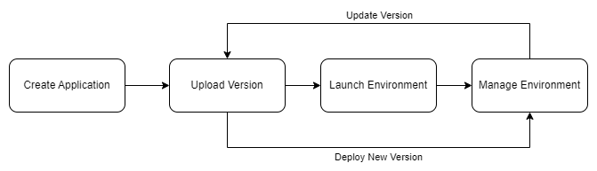

# AWS Tips to AWS Certified Developer - Associate<!-- omit in toc -->

## Contents <!-- omit in toc -->

- [1. S3](#1-s3)
- [2. DynamoDB](#2-dynamodb)
  - [2.1. General tips](#21-general-tips)
  - [2.2. Batch Operations](#22-batch-operations)
- [3. Kinesys](#3-kinesys)
- [4. KMS](#4-kms)
  - [4.1. Encrypt](#41-encrypt)
- [5. General tips](#5-general-tips)
- [6. ECS](#6-ecs)
- [7. X-Ray](#7-x-ray)
  - [7.1. Lambda Tracing with X-Ray](#71-lambda-tracing-with-x-ray)
  - [7.2. Read APIs](#72-read-apis)
- [8. Files](#8-files)
- [9. PartiQL](#9-partiql)
- [10. AWS CodeBuild](#10-aws-codebuild)
- [11. CodePipeline](#11-codepipeline)
- [12. ALG - Auto Scaling Group](#12-alg---auto-scaling-group)
- [13. CloudWatch Events](#13-cloudwatch-events)
- [14. VPC Endpoints](#14-vpc-endpoints)
- [15. Elastic Beanstalk](#15-elastic-beanstalk)
- [16. API Gateway](#16-api-gateway)
  - [16.1. Erros](#161-erros)
  - [16.2. CloudWatch metrics](#162-cloudwatch-metrics)
- [17. ALB - HealthCheck](#17-alb---healthcheck)
- [18. CloudFormation](#18-cloudformation)
- [19. CloudWatch](#19-cloudwatch)
- [20. Lambda](#20-lambda)
  - [20.1. Layers](#201-layers)
- [21. EC2](#21-ec2)
  - [21.1. Types EC2](#211-types-ec2)
- [22. Route 53](#22-route-53)

# 1. S3

- Your application can achieve at least:
  - **3,500 PUT/COPY/POST/DELETE.**
  - **5,500 GET/HEAD requests per second per prefix in a bucket.**
- Object values are the content of the body:
  - Max Object Size is 5TB (5000GB).
  - If uploading more than 5GB, must use "multi-part upload".

# 2. DynamoDB

## 2.1. General tips

- **UnprocessedKeys** for failed read operations (exponential backoff or add RCU).
  - For example, The DynamoDB API returns up to 100 items limited to 16MB per call. If there are still missing records to be returned, the API returns UnprocessedKeys until the process is finished.
    - In the present case, although we have 50 records, their total size is 50 x 2MB = 100MB, which exceeds the 16MB limit, so the message will be returned as follows:
      - Sixth call returns 16MB - 6 UnprocessedKeys (Total returned 92MB)
      - Seventh call returns 8MB - Query process terminated (Total returned 100MB)

## 2.2. Batch Operations

- `BatchWriteItem`
  - Up to 25 **PutItem** and/or **DeleteItem** in one call.
  - Up to 16 MB of data written, up to 400 KB of data per item.
- `BatchGetItem`
  - Return items from one or more tables.
  - Up to 100 items, up to 16 MB of data.

# 3. Kinesys

- 1 Shard = Capture, production or ingestion 1 MB / Distribution or consume 2 MB.

# 4. KMS

- Envelope Encryption
  - KMS Encrypt API call has a limit of 4 KB.
  - If you want to encrypt >4 KB, we need to use Envelope Encryption.

## 4.1. Encrypt

- It is recommended that you use the following pattern to encrypt data locally in your application:
  1. Use the GenerateDataKey operation to get a data encryption key.
  2. Use the plaintext data key (returned in the Plaintext field of the response) to encrypt data locally, then erase the plaintext data key from memory.
  3. Store the encrypted data key (returned in the CiphertextBlob field of the response) alongside the locally encrypted data.

# 5. General tips

- Resource-based = AWS Cross account.

# 6. ECS

- Task Placement Strategies
  - **Binpack**
    - Place tasks based on the least available amount of CPU or memory.
  - **Random**
    - Tasks are placed randomly.
  - **Spread**
  - Tasks are placed evenly based on the specified value.
    - Example: **instanceId, attribute:ecs.availability-zone, ...**
  - **Distinct Instance**
    - Tasks are placed on a different EC2 instance.
  - **memberOf**
    - Tasks are placed on EC2 instances that satisfy a specified expression.
    - Uses the **Cluster Query Language** (advanced).

# 7. X-Ray

- **Segments:** Each application / service will send them.
- **Subsegments:** If you need more details in your segment.
  - `namespace`
    - `aws` for AWS SDK calls.
    - `remote` for other downstream calls.
- **Trace:** Segments collected together to form an end-to-end trace.
- **Sampling:** Decrease the amount of requests sent to X-Ray, reduce cost.
- **Annotations:** Key Value pairs used to **index** traces and use with **filters**.
- **Metadata:** Key Value pairs, **not indexed**, not used for searching.
- The X-Ray daemon / agent has a config to send traces cross account:
  - Make sure the IAM permissions are correct - the agent will assume the role.
  - This allows to have a central account for all your application tracing.
- Example:
  ```
    "subsegments" : [
        {
          "id"         : "53995c3f42cd8ad8",
          "name"       : "api.example.com",
          "start_time" : 1461096053.37769,
          "end_time"   : 1461096053.40379,
          "namespace"  : "remote",
          "http"       : {
            "request"  : {
              "url"    : "https://api.example.com/health",
              "method" : "POST",
              "traced" : true
            },
            "response" : {
              "status"         : 200,
              "content_length" : 861
            }
          }
        }
      ]
  ```

## 7.1. Lambda Tracing with X-Ray

- Enable in Lambda configuration **(Active Tracing)**.
- Runs the X-Ray daemon for you.
- Use AWS X-Ray SDK in Code.
- Ensure Lambda Function has a correct IAM Execution Role.
  - The managed policy is called `AWSXRayDaemonWriteAccess`.
- Environment variables to communicate with X-Ray:
  - `_X_AMZN_TRACE_ID` - Contains the tracing header
  - `AWS_XRAY_CONTEXT_MISSING` - By default, LOG_ERROR
  - `AWS_XRAY_DAEMON_ADDRESS` - The X-Ray Daemon IP_ADDRESS:PORT

## 7.2. Read APIs

- `GetServiceGraph` - Main graph.
- `BatchGetTraces` - Retrieves a list of traces specified by ID.
  - Each trace is a collection of segment documents that originates from a single request.
- `GetTraceSummaries` - Retrieves IDs and annotations for traces available for a specified time frame using an optional filter. To get the full traces, pass the trace IDs to BatchGetTraces.
- `GetTraceGraph` - Retrieves a service graph for one or more specific trace IDs.

# 8. Files

- buildspec.yml - CodeBuild.
- appspec.yml - CodeDeploy.
- env.yml - Elastic Beanstalk.
  - .config - Configuration files are YAML- or JSON-formatted documents with a **.config** file extension that you place in a folder named **.ebextensions**.
- amplify.yml - Use the test step to run any test commands at build time.
- Dockerrun.aws.json - Is used to generate the ECS task definition in EBS.
- xray-daemon.config - You can run the daemon by setting an option in the Elastic Beanstalk console or with a configuration file.

# 9. PartiQL

- SQL-compatible query language for DynamoDB.
- Allows you to select, insert, update, and delete (but not all) data in DynamoDB using SQL.
- Run queries across multiple DynamoDB tables.
- Run PartiQL queries from:
  - AWS Management Console.
  - NoSQL Workbench for DynamoDB.
  - DynamoDB APIs.
  - AWS CLI.
  - AWS SDK.
- It supports Batch operations.

# 10. AWS CodeBuild

- **Source:** CodeCommit, S3, Bitbucket, GitHub.
- Phases order:
  - SUBMITTED
  - PROVISIONING
  - DOWNLOAD_SOURCE
    - INSTALL
    - PRE_BUILD
    - BUILD
    - POST_BUILD
  - UPLOAD_ARTIFACTS
  - FINALIZING

# 11. CodePipeline

- Phases order:
  - InProgress
  - Stopping
  - Stopped
  - Succeeded
  - Superseded
  - Failed

# 12. ALG - Auto Scaling Group

- Lauch template = Lauch onfiguration.

# 13. CloudWatch Events

- CloudWatch Events = Amazon EventBridge.

# 14. VPC Endpoints

- Endpoints allow you to connect to AWS Services **using a private network** instead of the public www network.
- This gives you enhanced security and lower latency to access AWS services.
- **VPC Endpoint Gateway**: S3 and DynamoDB.
- **VPC Endpoint Interface**: The rest.

# 15. Elastic Beanstalk



# 16. API Gateway

## 16.1. Erros

- 4xx means Client errors:
  - **400:** Bad Request.
  - **403:** Access Denied, WAF filtered.
  - **429:**
    - Quota exceeded.
    - Throttle.
- 5xx means Server errors:
  - **502:** Bad Gateway Exception, usually for an incompatible output returned from a Lambda proxy integration backend and occasionally for out-of-order invocations due to heavy loads.
  - **503:** Service Unavailable Exception.
  - **504:** Integration Failure - ex Endpoint Request Timed-out Exception API Gateway requests time out after 29 second maximum.

## 16.2. CloudWatch metrics

- Metrics are by stage, Possibility to enable detailed metrics.
- `CacheHitCount` - The number of requests served from the API cache in a given period.
- `CacheMissCount` - Tracks the number of requests served from the backend in a given period, when API caching is enabled.
- `Count` - The total number API requests in a given period.
- `IntegrationLatency` - The time between when API Gateway relays a request to the backend and when it receives a response from the backend.
- `Latency` - The time between when API Gateway receives a request from a client and when it returns a response to the client.
  - The latency includes the integration latency and other API Gateway overhead.
- **4XX Error** (client-side) & **5XX Error** (server-side).

# 17. ALB - HealthCheck

- `HealthyThresholdCount` - The number of consecutive successful health checks required before considering an unhealthy target healthy. The range is 2-10. The default is 5.
- `UnhealthyThresholdCount` - The number of consecutive failed health checks required before considering a target unhealthy. The range is 2-10. The default is 2.

# 18. CloudFormation

- **Structure**
  - **Resources**
    - They represent the different AWS Components that will be created and configured `Type: AWS::aws-product-name::data-type-name`.
    - Example: Type: AWS::EC2::Instance
  - **Parameters**
    - Parameters are a way to provide inputs to your AWS CloudFormation template.
    - The `Fn::Ref` function can be leveraged to reference parameters.
  - **Mapping**
    - We use `Fn::FindInMap` to return a named value from a specific key
      - `!FindInMap [ MapName, TopLevelKey, SecondLevelKey ]`
  - **Output**
    - Cross Stack Reference
      - We then create a second template that leverages that security group.
      - For this, we use the `Fn::ImportValue` function.
  - **Conditions**
    - Conditions are used to control the creation of **Resources** or **Outputs** based on a condition.
    - The intrinsic function **(logical)** can be any of the following:
      - `Fn::And`
      - `Fn::Equals`
      - `Fn::If`
      - `Fn::Not`
      - `Fn::Or`
- **Intrisic Funcionts**
  - Fn::Ref
  - Fn::GetAtt
  - Fn::FindInMap
  - Fn::ImportValue
  - Fn::Join
  - Fn::Sub
  - Fn::GetAZs
  - Fn::Select

# 19. CloudWatch

- Amazon CloudWatch Metrics
  - CloudWatch provides metrics for every services in AWS.
  - **Metric** is a variable to monitor (CPUUtilization, NetworkIn...).
  - Metrics belong to **namespaces**.
  - **Dimension** is an attribute of a metric (instance id, environment, etc...).
  - Up to 10 dimensions per metric.
  - Metrics have **timestamps**.
  - Can create CloudWatch dashboards of metrics.

# 20. Lambda

## 20.1. Layers

- Custom Runtimes:
  - Ex: C++ https://github.com/awslabs/aws-lambda-cpp
  - Ex: Rust https://github.com/awslabs/aws-lambda-rust-runtime
- Externalize Dependencies to re-use them.
- C++ and Rust
  - **Take note that this programming language is not natively supported yet in Lambda, which is why the use of a Custom Runtime is essential.**

# 21. EC2

## 21.1. Types EC2

- **General Purpose**
  - Great for a diversity of workloads such as web servers or code repositories.
  - Balance between:
    - Compute.
    - Memory.
    - Networking.
- **Compute Optimized**
  - Great for compute-intensive tasks that require high performance processors:
    - Batch processing workloads.
    - Media transcoding.
    - High performance web servers.
    - High performance computing (HPC).
    - Dedicated gaming servers.
- **Memory Optimized**
  - Fast performance for workloads that process large data sets in memory.
  - Use cases:
    - High performance, relational/non-relational databases.
    - Distributed web scale cache stores.
    - In-memory databases optimized for BI (business intelligence).
    - Applications performing real-time processing of big unstructured data.
- **Storage Optimized**
  - Great for storage-intensive tasks that require high, sequential read and write access to large data sets on local storage.
  - Use cases:
    - High frequency online transaction processing (OLTP) systems.
    - Relational & NoSQL databases.
    - Cache for in-memory databases (for example, Redis).
    - Data warehousing applications.
    - Distributed file systems.
- **Accelerated Computing**
  - Accelerated computing instances use hardware accelerators, or co-processors, to perform functions, such:
    - Floating point number calculations.
    - Graphics processing.
    - Data pattern matching.
    - Scientific modeling & machine learning.
  - More efficiently than is possible in software running on CPUs.

# 22. Route 53

Routing Policies

- Define how Route 53 responds to DNS queries.
- Don't get confused by the word "Routing":
  - It's not the same as Load balancer routing which routes the traffic.
  - DNS does not route any traffic, it only responds to the DNS queries.
- Route 53 Supports the following Routing Policies:
  - Simple.
  - Weighted.
  - Failover.
  - Latency based.
  - Geolocation.
  - Multi-Value Answer.
  - Geoproximity (using Route 53 Traffic Flow feature).
